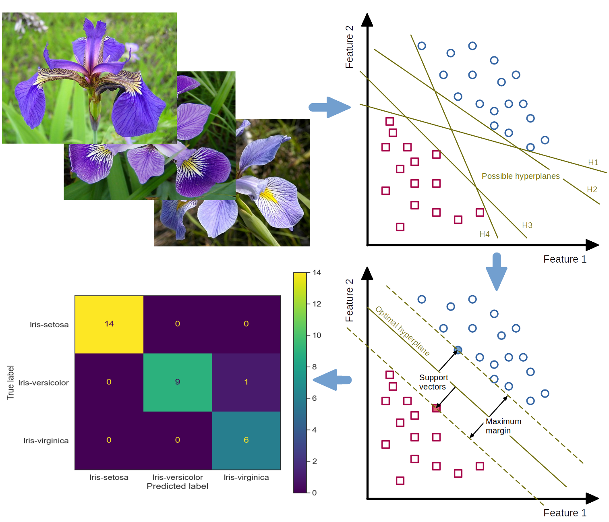

# Getting started with Machine Learning (ML) and Support Vector Classifiers (SVC) - A systematic step-by-step approach

Last changes on October 25, 2022.

## Table of contents

<!--
@HINT:
auto-generate the TOC with the command line tool 'gh-md-toc' (https://github.com/ekalinin/github-markdown-toc) with following syntax:
$ cat README.md | ./tools/github-markdown-toc/gh-md-toc - > toc.md
-->

- [Aim of the project](#aim-of-the-project)
- [Short introduction](#short-introduction)
- [Method of the Getting Started Tutorial](#method-of-the-getting-started-tutorial)
- [Overview of the main steps](#overview-of-the-main-steps)
- [License](#license)

## Aim of the project

From the perspective of **technical occupational safety and health (OSH)**, the safety-related assessment of systems capable of learning requires a more in-depth technical introduction to the world of **machine learning (ML)** as a subfield of **artificial intelligence (AI)**. To this end, OSH stakeholders should familiarize themselves with the basic modes of operation of typical ML algorithms, appropriate software tools, libraries and programming systems.

Therefore, this Getting Started Tutorial [Step-by-step_intro_to_ML_with_SVC_and_Iris.ipynb](./Step-by-step_intro_to_ML_with_SVC_and_Iris.ipynb) aims to demonstrate systematically and step-by-step the typical ML workflow using the very powerful and performant **Support Vector Classifier (SVC)** as an example. The process steps of **data analysis** and **classification** are illustrated by using the widely known and remarkably beginner-friendly **Iris dataset**. In addition, the selection of the ***correct*** **SVC kernel** and its **parameters** are described, and their effects on the classification result are shown.

In November 2022, the **Artificial Intelligence Conference** will be hosted by the German Social Accident Insurance (DGUV) in Dresden. This tutorial is to be presented to interested ML novices in the technical occupational safety and health of the social accident insurance institutions as part of a separate **Getting Started Workshop**.

## Short introduction

Very high requirements are placed on **highly automated** or **autonomous systems** and the AI algorithms used for this purpose with regard to **functional safety**. However, the requirements for safety evaluability in terms of **transparency** (complete understanding of the system) and **explainability** of decisions made by AI are currently very difficult or impossible to achieve, especially when using AI algorithms from the field of **deep learning** (<cite data-cite="Liggesmeyer_2019">Liggesmeyer und Kuhn, 2019</cite>).

Unlike automated systems, the functionality of AI-powered autonomous systems is not fully programmed out before operational use, but is created by applying algorithms with learning capabilities to data. This results in a model that is merely executed by the software at runtime. Due to its **inherent complexity**, the resulting model is generally **not comprehensible** to humans, which means that the **decisions** of an AI system are often **not transparent**. Although the requirements for the AI system typically cannot be fully described, it must still function reliably later at runtime in a very large application space (<cite data-cite="Schneider_2021">Heidrich et al., 2021</cite>). This pushes today's established methods and techniques of systematic software design and testing of safety-related software to their limits (cf. **V model** according to <cite data-cite="DIN_EN_61508-3_2011-02">DIN EN 61508-3:2011-02</cite>).

Compared to traditional, fully programmed software, the relatively low robustness of data-driven algorithms from the field of deep learning is another challenge. This can cause **small changes** in the function-determining **training data** to cause **large and unpredictable changes** in system behavior under some circumstances. However, the **predictability** and **transparency** of the system behavior are elementary for a **safety verification** (<cite data-cite="BAuA_Rechtsgutachten_KI_2021">BAuA-Rechtsgutachten KI-Systeme, 2021</cite>).

An appropriate assessment or even **testing** with regard to the required functional safety according to uniform and ideally standardized criteria has numerous consequences for the future orientation and organization of technical **occupational safety and health (OSH)** in Germany and in Europe. In addition to the currently still very difficult safety-related assessability, an important point is that the previous clear separation between **placing on the market law** (see e.g. Machinery Directive) and **occupational safety and health law** (see European Framework Directive for Occupational Safety and Health and German Ordinance on Occupational Safety and Health) can no longer be continued in this way. The reason for this is that **safety-related properties** will also change, especially of systems **continuously learning** at runtime, due to new or **adapted behaviors** learned during operation (<cite data-cite="BAuA_Rechtsgutachten_KI_2021">BAuA-Rechtsgutachten KI-Systeme, 2021</cite>). From today's point of view, systems based on **learned-out** and at runtime **invariable models** are not affected by this.

For these reasons, especially the actors of **technical occupational safety and health (OSH)** who will deal with the **evaluation** of such **systems capable of learning** or system components with AI algorithms in the future should familiarize themselves in depth with the software structures used for this purpose as early as possible. This is the only way to ensure that the rapid development of systems capable of learning can be accompanied by OSH and their testing authorities in a constructive, critical and technically appropriate manner. If this is omitted, it must be assumed on the basis of the experiences of recent years that the OSH system will be ruthlessly circumvented or undermined by the economic interests of globally operating software giants. This would have the consequence that serious or fatal **occupational accidents** are more likely to occur **due to inadequately designed AI-based work systems**.

## Method of the Getting Started Tutorial

The **main sections** of the Getting Started Tutorial will demonstrate the typical ML workflow step-by-step. In **step 0**, specific guidance is provided for selecting hardware and software suitable for machine learning. To allow an ML novice to first familiarize themselves with the ML algorithms, tools, libraries, and programming systems, the ready-made and very beginner-friendly **Iris dataset** is involved in **step 1**. Only after a comprehensive acquaintance with the application of ML tools would it make sense to examine one's own environment for ML-suitable applications and to obtain suitable datasets from them. However, this is beyond the scope of this introductory tutorial.

One of the most important steps in the entire ML process is **step 2**, in which the dataset included in step 1 is examined using typical data analysis tools. In addition to exploring the **data structure** and **internal correlations** in the dataset, errors such as gaps, duplications, or obvious misentries must also be found and corrected where possible. This is enormously important so that the classification can later provide plausible results.

After exploring the dataset, in **step 3** one has to decide on a specific ML algorithm based on certain selection criteria. Among other ML algorithms suitable for the Iris dataset (such as the decision-tree-based **random-forests classifier**), the reasoned choice here in the tutorial falls on the **support vector classifier**. A dedicated SVC model is now being implemented.

In **step 4** the dataset is preprocessed for the actual classification by SVC. Depending on the selected ML algorithm as well as the data structure, it may be necessary to prepare the data before training (e.g., by standardization or normalization). After splitting the dataset into a training and test dataset, the SVC model is trained with the training dataset in **step 5**. Subsequently, classification predictions are made with the trained SVC model based on the test data. In **step 6**, the quality of the classification result is evaluated using known **metrics** such as the **confusion matrix**.

Since the classification in step 5 was initially performed with standard parameters (so-called **hyper-parameters**), their meaning is explained in **step 7** and then their effect on the classification result is demonstrated by manually varying the individual hyper-parameters.

In the final **step 8**, two approaches to systematic hyper-parameter search are presented: **Grid Search** and **Randomized Search**. While the former exhaustively considers all parameter combinations for given values, the latter selects a number of candidates from a parameter space with a particular random distribution.

## Overview of the main steps

The following **steps of the systematic ML process** are covered in the main sections of the tutorial [Step-by-step_intro_to_ML_with_SVC_and_Iris.ipynb](./Step-by-step_intro_to_ML_with_SVC_and_Iris.ipynb):

- STEP 0: Select hardware and software suitable for ML
- STEP 1: Acquire the ML dataset
- STEP 2: Explore the ML dataset
- STEP 3: Choose and create the ML model
- STEP 4: Preprocess the dataset for training
- STEP 5: Carry out training, prediction and testing
- STEP 6: Evaluate model's performance
- STEP 7: Vary parameters of the ML model manually
- STEP 8: Tune the ML model systematically

## License

This project is licensed under the terms of "GNU General Public License v3.0". For details see [LICENSE](./LICENSE).

