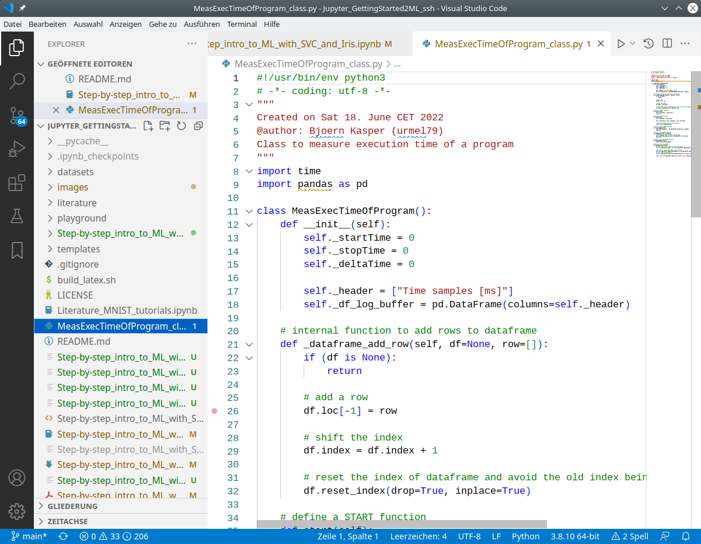
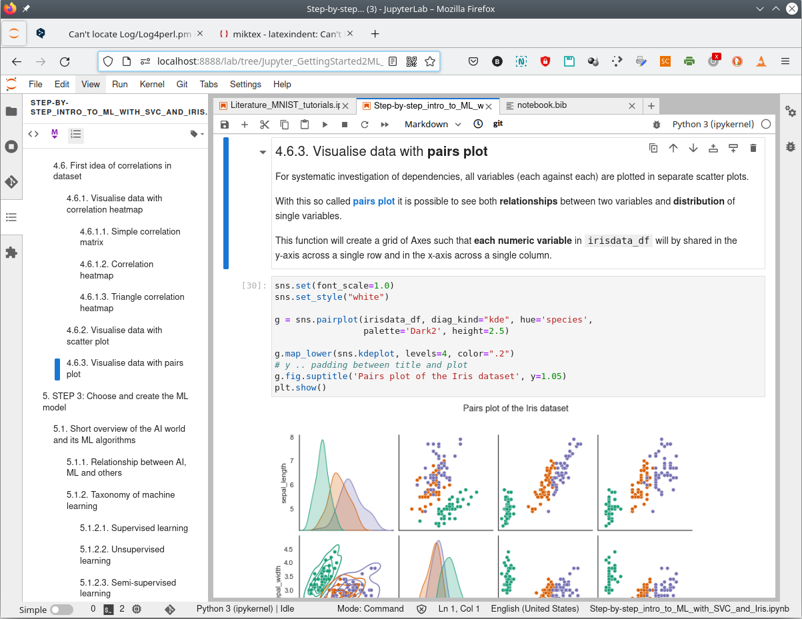
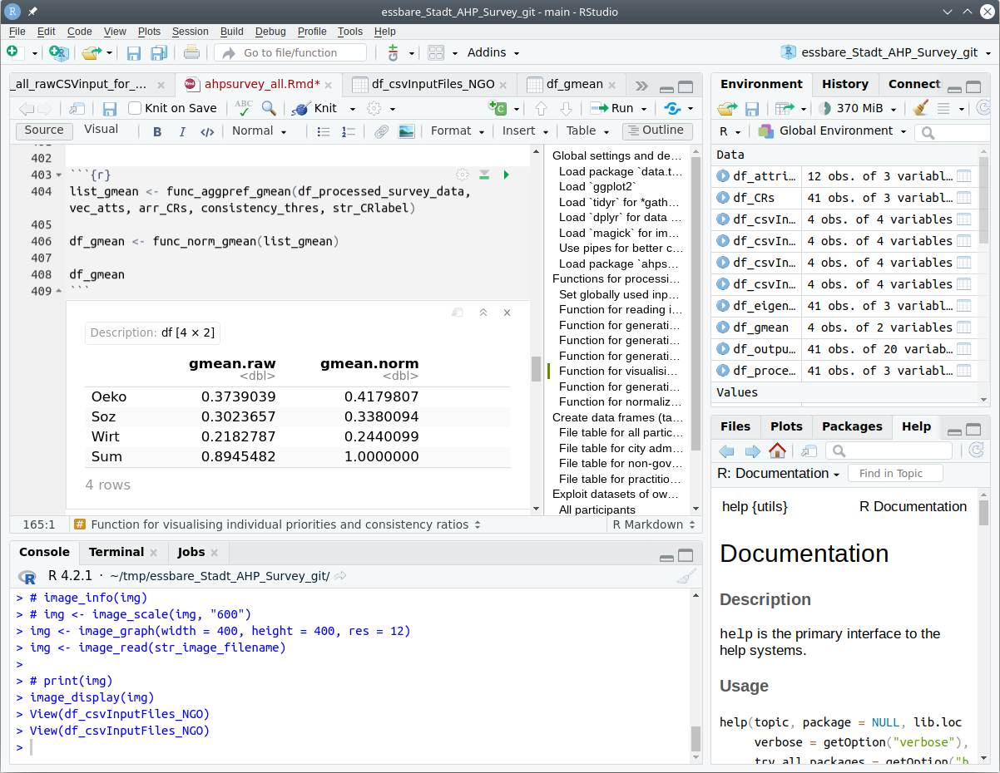
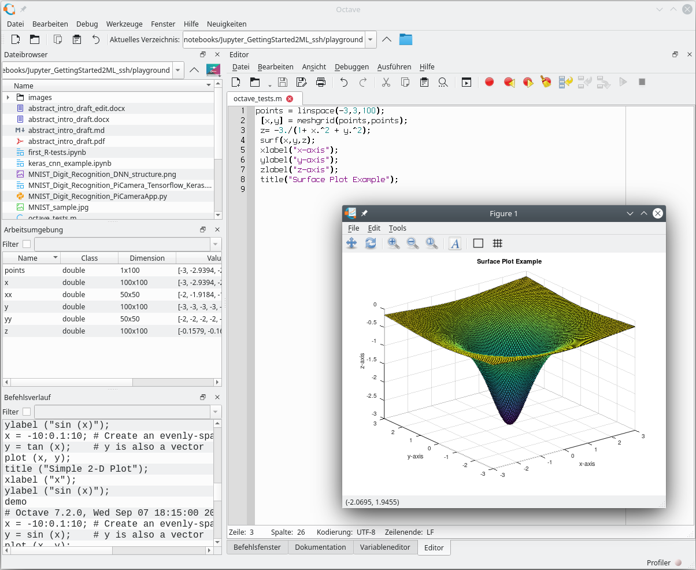
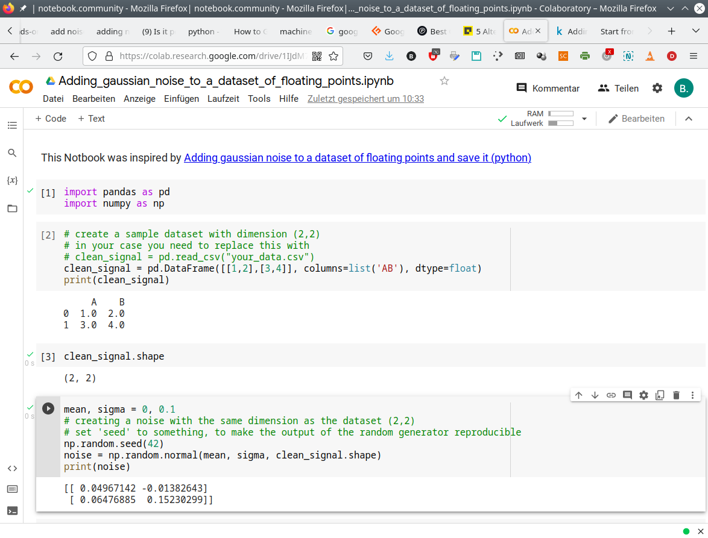
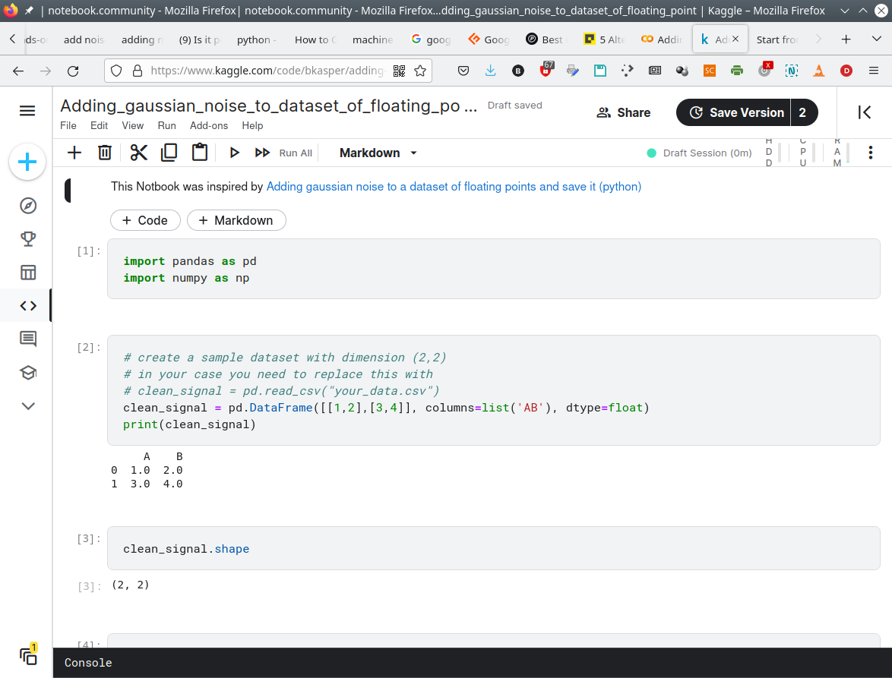
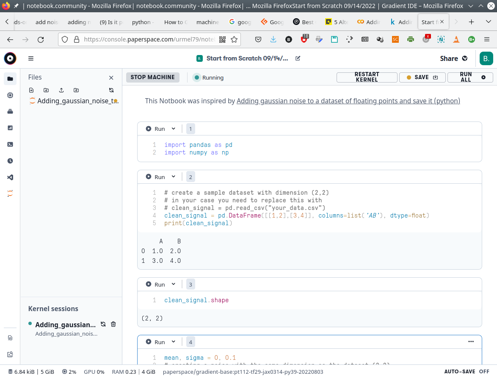
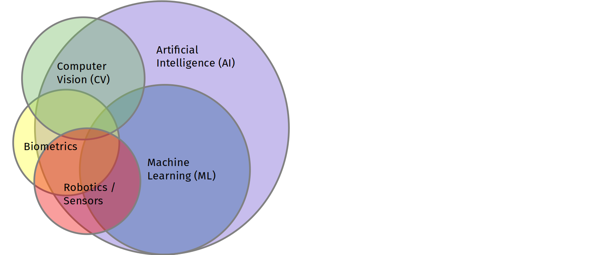
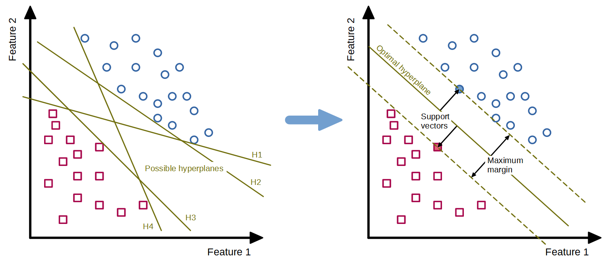

---
jupyter:
  jupytext:
    formats: ipynb,md
    text_representation:
      extension: .md
      format_name: markdown
      format_version: '1.3'
      jupytext_version: 1.13.7
  kernelspec:
    display_name: Python 3 (ipykernel)
    language: python
    name: python3
---

<!-- #region toc-hr-collapsed=true tags=[] -->
# Introduction
<!-- #endregion -->

<!-- #region tags=[] -->
## English introduction

In the **digitized work environment**, there is an increasing demand for **Work equipment** to be able to adapt independently and in a task-related manner to changing work situations. Depending on the strength of the degree of flexibility, this **situational adaptivity** can often only be realized by applying mathematical models and algorithms from the field of **Machine Learning (ML)** as a subset of **Artificial Intelligence (AI)**.

Examples of such AI applications in work environments can range from comparatively simple **voice assistance systems** (similar, for example, to Siri or Alexa from the private sphere) to partially or **highly automated systems**. The transition from **automation to autonomy** is currently the subject of much controversy among experts and can be viewed in terms of the transition of responsibility from humans to technical systems (<cite data-cite="Adler_2021">Adler, 2021</cite>; <cite data-cite="Adler_2019">Adler, 2019</cite>).

By definition, a system is called **autonomous** only when it can achieve a given goal **independently** and adapted to the situation **without human control** or detailed **programming** (<cite data-cite="EFI_autSysteme_2018">EFI Report, 2018</cite>; <cite data-cite="acatech_2017">acatech, 2017</cite>).

However, the distinction between the  degree of automation and the autonomy of a technical system is relatively vague and difficult to define, depending on the technical context and the degree of abstraction. Crucial for the classification are the degrees of **self-determination**, **independence** as well as the **freedom of decision or action** of a technical system towards **human intervention** or preprogrammed behavior patterns (vgl. <cite data-cite="Wiki_Autonomie">Wikipedia: Autonomie</cite>).

In contrast to highly automated systems, autonomous systems are only able to act autonomously, solve problems, and learn to constantly improve in the process through the use of AI algorithms (<cite data-cite="acatech_2017">acatech, 2017</cite>).

For example, **driverless transport systems (AGVs)** can navigate **autonomously** through larger industrial facilities using self-learned self-updated maps shared with other AGVs, and avoid location-changing obstacles by independently finding and optimizing suitable routes. However, at a higher level of abstraction, new logistics tasks are given to them by human operators, which is why AGVs tend to be **highly automated systems** from a human perspective.

In addition to the many very interesting advantages, e.g. in terms of economic efficiency and workload reduction, such highly automated systems and, depending on the point of view, autonomous subsystems are characterized by a very high level of technical complexity. This concerns both their **operating functions** (e.g. autonomous navigation through complex industrial environments with shared use of the roadways by other human-controlled vehicles) and their **safety functions** (e.g. evaluation of interlinked imaging and non-imaging safety sensors for monitoring the driving space to avoid collisions).

Very high requirements are placed on such autonomous systems and the AI algorithms used for this purpose with regard to **functional safety**. However, the requirements for safety evaluability in terms of **transparency** (complete understanding of the system) and **explainability** of decisions made by AI are currently very difficult or impossible to achieve, especially when using AI algorithms from the field of **deep learning** (<cite data-cite="Liggesmeyer_2019">Liggesmeyer und Kuhn, 2019</cite>).

Unlike automated systems, the functionality of AI-powered autonomous systems is not fully programmed out before operational use, but is created by applying algorithms with learning capabilities to data. This results in a model that is merely executed by the software at runtime. Due to its **inherent complexity**, the resulting model is generally **not comprehensible** to humans, which means that the **decisions** of an AI system are often **not transparent**. Although the requirements for the AI system typically cannot be fully described, it must still function reliably later at runtime in a very large application space (<cite data-cite="Schneider_2021">Heidrich et al., 2021</cite>). This pushes today's established methods and techniques of systematic software design and testing of safety-related software to their limits (cf. **V model** according to <cite data-cite="DIN_EN_61508-3_2011-02">DIN EN 61508-3:2011-02</cite>).

Furthermore, in terms of their **recognition rates** and thus the **reliability of their decisions**, today's AI algorithms very often do not meet the functional safety requirements to achieve higher safety levels, even under the most favorable conditions. For example, a software-based safety function with a performance level d $(PL_{d})$ typically required for machines in accordance with ISO 13849-1 may only fail dangerously with a probability of $10^{-7} - 10^{-6}$ per hour during continuous use (see table K.1 in <cite data-cite="DIN_EN_ISO_13849-1_2016">DIN EN ISO 13849-1:2016-06</cite>).

Compared to traditional, fully programmed software, the relatively low robustness of data-driven algorithms from the field of deep learning is another challenge. This can cause **small changes** in the function-determining **training data** to cause **large and unpredictable changes** in system behavior under some circumstances. However, the **predictability** and **transparency** of the system behavior are elementary for a **safety verification** (<cite data-cite="BAuA_Rechtsgutachten_KI_2021">BAuA-Rechtsgutachten KI-Systeme, 2021</cite>).

An appropriate assessment or even **testing** with regard to the required functional safety according to uniform and ideally standardized criteria has numerous consequences for the future orientation and organization of technical **occupational safety and health (OSH)** in Germany and in Europe. In addition to the currently still very difficult safety-related assessability, an important point is that the previous clear separation between **placing on the market law** (see e.g. Machinery Directive) and **occupational safety and health law** (see European Framework Directive for Occupational Safety and Health and German Ordinance on Occupational Safety and Health) can no longer be continued in this way. The reason for this is that **safety-related properties** will also change, especially of systems **continuously learning** at runtime, due to new or **adapted behaviors** learned during operation (<cite data-cite="BAuA_Rechtsgutachten_KI_2021">BAuA-Rechtsgutachten KI-Systeme, 2021</cite>). From today's point of view, systems based on **learned-out** and at runtime **invariable models** are not affected by this.

For these reasons, especially the actors of **technical occupational safety and health** who will deal with the **evaluation** of such **systems capable of learning** or system components with AI algorithms in the future should familiarize themselves in depth with the software structures used for this purpose as early as possible. This is the only way to ensure that the rapid development of systems capable of learning can be accompanied by OSH and their testing authorities in a constructive, critical and technically appropriate manner. If this is omitted, it must be assumed on the basis of the experiences of recent years that the OSH system will be ruthlessly circumvented or undermined by the economic interests of globally operating software giants. This would have the consequence that serious or fatal **occupational accidents** are more likely to occur **due to inadequately designed AI-based work systems**.

However, the safety-related evaluation of such learning-capable systems requires a more in-depth technical entry into the world of **machine learning** as a subfield of **artificial intelligence**. For this purpose, it is necessary to deal with the basic operation of typical ML algorithms, corresponding software tools, libraries and programming systems.

However, someone who opens the door for the first time to this equally very exciting as well as arbitrarily complex and, at first glance, confusing world will very quickly be overwhelmed. In addition to reading general technical literature, it is advisable to consult introductory and systematic tutorials.

This Getting Started tutorial has exactly this goal, demonstrating systematically and step-by-step the typical ML workflow using the very powerful **Support Vector Classifier (SVC)** as an example.

This tutorial will be presented in the context of a workshop at the **Conference "Artificial Intelligence "**, hosted by the German Social Accident Insurance (DGUV), probably in November 2022 in Dresden. The workshop addresses interested ML novices in the technical occupational safety and health of the social accident insurance institutions.

Besides the **deep neural networks**, which are very present in the media, there is a very rich diversity of other very powerful ML algorithms - suitable for the particular use case. For a more generally comprehensible introduction, the SVC algorithm was deliberately chosen for the target audience of the workshop. Its operating principles are easy to convey to ML novices as well as in the time frame given for the workshop - quite in contrast to the entry into the world of deep neural networks.

The following main sections will demonstrate the typical ML workflow step-by-step. In **step 0**, specific guidance is provided for selecting hardware and software suitable for machine learning. To allow an ML novice to first familiarize themselves with the ML algorithms, tools, libraries, and programming systems, the ready-made and very beginner-friendly **Iris dataset** is involved in **step 1**. Only after a comprehensive acquaintance with the application of ML tools would it make sense to examine one's own environment for ML-suitable applications and to obtain suitable datasets from them. However, this is beyond the scope of this introductory tutorial.

One of the most important steps in the entire ML process is **step 2**, in which the dataset included in step 1 is examined using typical data analysis tools. In addition to exploring the **data structure** and **internal correlations** in the dataset, errors such as gaps, duplications, or obvious misentries must also be found and corrected where possible. This is enormously important so that the classification can later provide plausible results.

After exploring the dataset, in **step 3** one has to decide on a specific ML algorithm based on certain selection criteria. Among other ML algorithms suitable for the Iris dataset (such as the decision-tree-based **random-forests classifier**), the reasoned choice here in the tutorial falls on the **support vector classifier**. A dedicated SVC model is now being implemented.

In **step 4** the dataset is prepared for the actual classification by SVC. Depending on the selected ML algorithm as well as the data structure, it may be necessary to prepare the data before training (e.g., by standardization, normalization, or binarization based on thresholds). After splitting the dataset into a training and test dataset, the SVC model is trained with the training dataset in **step 5**. Subsequently, classification predictions are made with the trained SVC model based on the test data. In **step 6**, the quality of the classification result is evaluated using known **metrics** such as the **confusion matrix**.

Since the classification in step 5 was initially performed with standard parameters (so-called **hyper-parameters**), their meaning is explained in **step 7** and then their effect on the classification result is demonstrated by manually varying the individual hyper-parameters.

In the final **step 8**, two approaches to systematic hyper-parameter search are presented: **Grid Search** and **Randomized Search**. While the former exhaustively considers all parameter combinations for given values, the latter selects a number of candidates from a parameter space with a particular random distribution.
<!-- #endregion -->

<!-- #region tags=[] jp-MarkdownHeadingCollapsed=true tags=[] -->
## German introduction

Von den **Arbeitsmitteln** in der **digitalisierten Arbeitswelt** wird immer stärker gefordert, dass sie sich selbstständig und aufgabenbezogen an sich ändernde Arbeitssituationen anpassen können. Diese **situative Adaptivität** kann je nach Stärke des Flexibilisierungsgrades oft nur durch die Anwendung mathematischer Modelle und Algorithmen aus dem Bereich des **Maschinellen Lernens (ML)** als Teilmenge der **Künstlichen Intelligenz (KI)** realisiert werden.

Beispiele für solche KI-Anwendungen in der Arbeitswelt reichen von vergleichsweise einfachen **Sprachassistenzsystemen** (ähnlich z. B. Siri oder Alexa aus dem privaten Umfeld) bis hin zu teil- oder **hochautomatisierten Systemen**. Der Übergang von **Automatisierung zu Autonomie** wird derzeit in der Fachwelt sehr kontrovers diskutiert und kann unter dem Aspekt des Übergangs der Verantwortung vom Menschen zum technischen System betrachtet werden (<cite data-cite="Adler_2021">Adler, 2021</cite>; <cite data-cite="Adler_2019">Adler, 2019</cite>).

Definitionsgemäß wird ein System erst dann als **autonom** bezeichnet, wenn es **ohne menschliche Steuerung** oder detaillierte **Programmierung** ein vorgegebenes Ziel **selbstständig** und an die Situation angepasst erreichen kann (<cite data-cite="EFI_autSysteme_2018">EFI Report, 2018</cite>; <cite data-cite="acatech_2017">acatech, 2017</cite>).

Allerdings ist die Unterscheidung des Grades der Automatisierung bis hin zur Autonomie eines technischen Systems relativ fließend und je nach fachlichem Kontext und Abstraktionsgrad nur schwer zu definieren. Maßgeblich für die Einordnung sind die Grade der **Selbstbestimmtheit**, die **Unabhängigkeit** sowie die **Entscheidungs- bzw. Handlungsfreiheit** eines technischen Systems gegenüber **menschlichem Eingriff** oder vorprogrammierter Verhaltensmuster (vgl. <cite data-cite="Wiki_Autonomie">Wikipedia: Autonomie</cite>).

Im Gegensatz zu hochautomatisierten Systemen sind autonome Systeme nur durch Einsatz von KI-Algorithmen in der Lage, eigenständig zu agieren, Probleme zu lösen und dabei zu lernen, sich ständig zu verbessern (<cite data-cite="acatech_2017">acatech, 2017</cite>).

Beispielsweise können **fahrerlose Transportsysteme (FTS)** anhand selbst erlernter, selbstständig aktualisierter und mit anderen FTS geteilter Karten **autonom** durch größere Industrieanlagen navigieren und ortsveränderlichen Hindernissen ausweichen, indem sie selbstständig geeignete Routen finden und optimieren. Jedoch werden ihnen in einer höheren Abstraktionsebene neue Logistikaufträge durch menschliche Bediener vorgegeben, weswegen es sich bei FTS aus menschlicher Perspektive eher um **hochautomatisierte Systeme** handelt.

Neben den vielen sehr interessanten Vorteilen z. B. bzgl. Wirtschaftlichkeit und Arbeitserleichterung kennzeichnet solche hochautomatisierten und je nach Betrachtung autonomen Teilsysteme eine sehr hohe technische Komplexität. Diese betrifft sowohl ihre **Betriebsfunktionen** (z. B. autonome Navigation durch komplexe industrielle Umgebungen bei gemeinsamer Nutzung der Fahrwege durch andere menschlich gesteuerte Fahrzeuge) als auch ihre **Sicherheitsfunktionen** (z. B. Auswertung miteinander verknüpfter bildgebender und nicht-bildgebender Sicherheitssensorik zur Überwachung des Fahrraums zur Kollisionsvermeidung).

An solche autonomen Systeme und die hierfür eingesetzten KI-Algorithmen werden sehr hohe Anforderungen hinsichtlich der **funktionalen Sicherheit** gestellt. Jedoch sind die Anforderungen für eine sicherheitstechnische Bewertbarkeit bezüglich der **Transparenz** (vollständiges Systemverständnis) und **Erklärbarkeit** der durch KI getroffenen Entscheidungen insbesondere bei Einsatz von KI-Algorithmen aus dem Bereich des **Deep Learnings** derzeit nur sehr schwer oder gar nicht erreichbar (<cite data-cite="Liggesmeyer_2019">Liggesmeyer und Kuhn, 2019</cite>). 

Im Gegensatz zu automatisierten Systemen wird die Funktionalität KI-gestützter autonomer Systeme nicht vor der betrieblichen Verwendung vollständig ausprogrammiert, sondern durch das Anwenden lernfähiger Algorithmen auf Daten erstellt. Dadurch entsteht ein Modell, das von der Software zur Laufzeit lediglich ausgeführt wird. Das resultierende Modell ist aufgrund seiner **inhärenten Komplexität** im Allgemeinen **für den Menschen nicht verständlich**, wodurch die **Entscheidungen** eines KI-Systems oft **nicht transparent** sind. Obwohl die Anforderungen an das KI-System typischerweise nicht vollständig beschrieben werden können, muss es später zur Laufzeit in einem sehr großen Anwendungsraum trotzdem verlässlich funktionieren (<cite data-cite="Schneider_2021">Heidrich et al., 2021</cite>). Dadurch kommen die heute etablierten Methoden und Techniken des systematischen Softwareentwurfes und -testens sicherheitsgerichteter Software an ihre Grenzen (vgl. **V-Modell** nach <cite data-cite="DIN_EN_61508-3_2011-02">DIN EN 61508-3:2011-02</cite>).

Weiterhin erfüllen heutige KI-Algorithmen hinsichtlich ihrer erreichbaren **Erkennungsraten** und damit der **Zuverlässigkeiten ihrer Entscheidungen** selbst unter günstigsten Bedingungen sehr oft nicht die Anforderungen an die funktionale Sicherheit, um höhere Safety-Level zu erreichen. Beispielsweise darf eine software-gestützte Sicherheitsfunktion mit einem für Maschinen typischerweise geforderten Performance Level d $(PL_{d})$ nach ISO 13849-1 bei kontinuierlicher Nutzung nur mit einer Wahrscheinlichkeit von $10^{-7} - 10^{-6}$ pro Stunde gefährlich ausfallen (siehe Tabelle K.1 in <cite data-cite="DIN_EN_ISO_13849-1_2016">DIN EN ISO 13849-1:2016-06</cite>).

Im Vergleich zu traditioneller, vollständig ausprogrammierter Software ist bei datengetriebenen Algorithmen aus dem Bereich des Deep Learnings die verhältnismäßig geringe Robustheit eine weitere Herausforderung. Diese kann dazu führen, dass **kleine Änderungen** in den funktionsbestimmenden **Trainingsdaten** unter Umständen **große und unvorhersehbare Veränderungen** des Systemverhaltens bewirken. Jedoch sind die **Vorhersehbarkeit** und **Nachvollziehbarkeit** des Systemverhaltens für einen **Sicherheitsnachweis** elementar (<cite data-cite="BAuA_Rechtsgutachten_KI_2021">BAuA-Rechtsgutachten KI-Systeme, 2021</cite>).

Eine hinsichtlich der geforderten funktionalen Sicherheit angemessene Bewertung oder gar **Prüfung** nach einheitlichen und idealerweise genormten Maßstäben hat viele Konsequenzen für die zukünftige Ausrichtung und Gestaltung des **technischen Arbeitsschutzes** in Deutschland und in Europa. Neben der derzeit noch sehr schwierigen sicherheitstechnischen Bewertbarkeit von KI-Algorithmen ist ein wichtiger Punkt, dass die bisherige klare Trennung zwischen **Inverkehrbringensrecht** (siehe z. B. Maschinenrichtlinie) und **betrieblichem Arbeitsschutzrecht** (siehe Arbeitsschutz-Rahmenrichtlinie und Betriebssicherheitsverordnung) so nicht mehr aufrechterhalten werden kann. Grund hierfür ist, dass sich auch die **sicherheitsrelevanten Eigenschaften** insbesondere von zur Laufzeit **weiterlernenden Systemen** durch während des Betriebs erlernte, neue oder **angepasste Verhaltensweisen** verändern werden (<cite data-cite="BAuA_Rechtsgutachten_KI_2021">BAuA-Rechtsgutachten KI-Systeme, 2021</cite>). Systeme auf Basis **ausgelernter** und zur Laufzeit **unveränderlicher Modelle** sind aus heutiger Sicht hiervon nicht betroffen.

Aus diesen Gründen sollten sich insbesondere die Akteure des **technischen Arbeitsschutzes**, die sich zukünftig mit der **Prüfung** solcher **lernfähigen Systeme** oder Systemkomponenten mit KI-Algorithmen befassen werden, möglichst frühzeitig mit den hierfür eingesetzten Software-Strukturen vertieft auseinandersetzen. Nur dadurch lässt sich erreichen, dass die stürmische Entwicklung lernfähiger Systeme durch den Arbeitsschutz und dessen Prüfinstitute konstruktiv, kritisch und fachlich angemessen begleitet werden kann. Wird dies versäumt, muss aufgrund der Erfahrungen der vergangenen Jahre davon ausgegangen werden, dass das Arbeitsschutzsystem durch die wirtschaftlichen Interessen global agierender Softwaregiganten skrupellos umgangen oder ausgehebelt werden wird. Dies hätte die Folge, dass schwere oder tödliche **Arbeitsunfälle wegen unzulänglich gestalteter KI-basierter Arbeitssysteme** wahrscheinlicher werden.

Allerdings erfordert die sicherheitstechnische Bewertung solcher lernfähigen Systeme einen tiefer gehenden fachlichen Einstieg in die Welt des **maschinellen Lernens** als Teilgebiet der **künstlichen Intelligenz**. Hierzu muss sich mit den grundlegenden Funktionsweisen typischer ML-Algorithmen, entsprechenden Software-Werkzeugen, Bibliotheken und Programmiersystemen auseinander gesetzt werden.

Wer jedoch zum ersten Mal die Tür zu dieser ebenso spannenden wie beliebig komplexen und auf den ersten Blick verwirrenden Welt öffnet, wird sehr schnell überfordert sein. Hier empfiehlt es sich neben dem Lesen allgemeiner Fachliteratur, einführende und systematische Anleitungen zu Rate zu ziehen.

Genau dieses Ziel verfolgt das vorliegende Getting-Started-Tutorial, indem systematisch und Schritt-für-Schritt der typische ML-Arbeitsablauf am Beispiel des sehr leistungsfähigen **Support Vector Classifier (SVC)** demonstriert wird.

Dieses Tutorial wird im Rahmen eines Workshops auf der **Fachtagung "Künstliche Intelligenz"**, ausgerichtet durch die Deutsche Gesetzliche Unfallversicherung (DGUV), voraussichtlich im November 2022 in Dresden vorgestellt. Der Workshop richtet sich an interessierte ML-Neulinge im technischen Arbeitsschutz der gesetzlichen Unfallversicherungsträger.

Neben den medial sehr präsenten **tiefen neuronalen Netzen** gibt es eine sehr reichhaltige Auswahl anderer sehr leistungsfähiger ML-Algorithmen - passend für den jeweiligen Anwendungsfall. Für einen allgemein verständlicheren Einstieg wurde für die Zielgruppe des Workshops der SVC-Algorithmus bewusst gewählt. Dessen Arbeitsweise ist sowohl für ML-Neulinge als auch in dem für den Workshop vorgegebenen Zeitrahmen leicht vermittelbar - ganz im Gegensatz zum Einstieg in die Welt der tiefen neuronalen Netze.

Die folgenden Hauptabschnitte demonstrieren den typischen ML-Arbeitsablauf Schritt-für-Schritt. Im **Schritt 0** werden konkrete Hinweise für die Auswahl der für das maschinelle Lernen geeigneten Hardware und Software gegeben. Damit sich ein ML-Neuling zunächst mit den ML-Algorithmen, Werkzeugen, Bibliotheken und Programmiersystemen vertraut machen kann, wird im **Schritt 1** der fertige und sehr einsteigerfreundliche **Iris-Datensatz** hinzugezogen. Erst nach einer umfassenden Einarbeitung in die Anwendung der ML-Werkzeuge wäre es sinnvoll, die eigene Umgebung auf ML-taugliche Anwendungen hin zu untersuchen und daraus geeignete Datensätze zu gewinnen. Dies geht jedoch über den Rahmen dieses einführenden Tutorials hinaus.

Mit der wichtigste Schritt im gesamten ML-Prozess ist **Schritt 2**, in dem der in Schritt 1 einbezogene Datensatz mit Hilfe typischer Datenanalyse-Werkzeuge untersucht wird. Neben der Erkundung der **Datenstruktur** sowie **innerer Zusammenhänge** im Datensatz müssen auch Fehler wie z. B. Lücken, Dopplungen oder offensichtliche Fehleingaben gefunden und nach Möglichkeit behoben werden. Dies ist enorm wichtig, damit die Klassifikation später plausible Ergebnisse liefern kann.

Nach der Erkundung des Datensatzes muss man sich im **Schritt 3** anhand bestimmter Auswahlkriterien für einen konkreten ML-Algorithmus entscheiden. Neben anderen für den Iris-Datensatz passenden ML-Algorithmen (wie z. B. der entscheidungsbaum-basierte **Random-forests-Classifier**) fällt die begründete Auswahl hier im Tutorial auf den **Support-Vector-Classifier**. Ein entsprechendes SVC-Modell wird nun implementiert.

Im **Schritt 4** wird der Datensatz für die eigentliche Klassifikation per SVC vorbereitet. Je nach gewähltem ML-Algorithmus sowie der Datenstruktur kann es erforderlich sein, dass die Daten vor dem Training aufbereitet werden müssen (z. B. durch Standardisierung, Normalisierung oder Binärisierung anhand von Schwellwerten). Nach der Aufteilung des Datensatzes in einen Trainings- und Testdatensatz, wird das SVC-Modell im **Schritt 5** mit dem Trainingsdatensatz trainiert. Anschließend werden mit dem trainierten SVC-Modell anhand der Testdaten Klassifikationsvorhersagen getroffen. Im **Schritt 6** wird die Güte des Klassifikationsergebnisses anhand bekannter **Metriken** wie z. B. der **Konfusionsmatrix** evaluiert.

Da die Klassifikation im Schritt 5 zunächst mit Standard-Parametern (den sogenannte **Hyper-Parametern**) durchgeführt wurde, wird ihre Bedeutung im **Schritt 7** erklärt und danach ihr Einfluss auf das Klassifikationsergebnis durch manuelle Variation der einzelnen Hyper-Parameter demonstriert.

Im abschließenden **Schritt 8** werden zwei Ansätze zur systematischen Hyper-Parameter-Suche vorgestellt: **Grid Search** und **Randomized Search**. Während bei ersterer für gegebene Werte erschöpfend alle Parameterkombinationen betrachtet werden, wird beim zweiten Ansatz eine Anzahl von Kandidaten aus einem Parameterraum mit einer bestimmten zufälligen Verteilung ausgewählt.
<!-- #endregion -->

## Steps of the systematic ML process

The following **steps of the systematic ML process** are covered in the next main sections:

- [STEP 0: Select hardware and software suitable for ML](#STEP-0:-Select-hardware-and-software-suitable-for-ML)
- [STEP 1: Acquire the ML dataset](#STEP-1:-Acquire-the-ML-dataset)
- [STEP 2: Explore the ML dataset](#STEP-2:-Explore-the-ML-dataset)
- [STEP 3: Choose and create the ML model](#STEP-3:-Choose-and-create-the-ML-model)
- [STEP 4: Prepare the dataset for training](#STEP-4:-Prepare-the-dataset-for-training)
- [STEP 5: Carry out training, prediction and testing](#STEP-5:-Carry-out-training,-prediction-and-testing)
- [STEP 6: Evaluate model's performance](#STEP-6:-Evaluate-model's-performance)
- [STEP 7: Vary parameters of the ML model manually](#STEP-7:-Vary-parameters-of-the-ML-model-manually)
- [STEP 8: Tune the ML model systematically](#STEP-8:-Tune-the-ML-model-systematically)

<!-- #region tags=[] toc-hr-collapsed=true toc-hr-collapsed=true tags=[] -->
# STEP 0: Select hardware and software suitable for ML

In this step, specific guidance is provided for selecting hardware and software suitable for machine learning.
<!-- #endregion -->

## Community Support

When selecting and deciding for or against the use of certain hardware and software components, in addition to purely technical or financial characteristics, significant attention should be paid to broad **support from a well-networked community**. This community should consist of a balanced share of **manufacturers** of hardware components (e.g. GPU suppliers, manufacturers of embedded systems or sensors), **software developers** ideally from the **open source** ecosystem, and an active **user community** (e.g. for reporting hardware and software bugs or providing help in forums).

The author's many years of development experience show that the technically best hardware or software component is worthless if you are (apparently) the only user. This impression arises either because the component is actually very exotic and has only a few users or because the development takes place "behind closed doors", i.e. in the company's internal **closed source** domain.

Without the support of an active community, you are (almost) on your own when it comes to questions or problems. Progress in the development and maintenance of an AI application is therefore very difficult!
The clear recommendation is therefore: Go for the (technically, price-wise, etc.) **second-best alternative** but with an even bigger **community**.


## Hardware

When considering hardware requirements, two systems and their use cases must be taken into account: the **training system** and the **application system**.

### Training system

The **training phase** requires a lot of **computational power** and **memory (RAM)**, depending on the **amount of data** to be processed and the **ML algorithm (so-called estimator)** chosen.

Depending on the estimator model, highly parallel processing on a **Graphics Processing Unit (GPU)** can provide significant **speed advantages** over processing on a **Central Processing Unit (CPU)** (e.g., when training deep neural networks in the area of **deep learning**). To take advantage of this speed benefit, the AI application must be suitable in terms of **parallelizability** of the estimator model used as well as **GPU support** through special driver layers, the so-called [Operating System Abstraction Layer (OSAL)](https://en.wikipedia.org/wiki/Operating_system_abstraction_layer) (<cite data-cite="Wiki_OSAL">Wikipedia: OSAL</cite>).

Such GPUs are installed on powerful **3D graphics cards**. However, these must be explicitly qualified for the application for AI - not every game-suitable graphics card from any manufacturer can be used. The manufacturer **Nvidia** offers GPUs suitable for AI in its high-performance graphics cards with **CUDA architecture**. [CUDA](https://en.wikipedia.org/wiki/CUDA) stands for "Compute Unified Device Architecture" and is a **programming interface** (API) developed by Nvidia, with which program parts can be processed by the graphics processor (<cite data-cite="Wiki_CUDA">Wikipedia: CUDA</cite>). A GPU with its several tens of thousands of threads can process highly parallelizable tasks that require only little data communication between the memory areas significantly more performantly than conventional CPUs. This speed advantage can be considerable despite currently available CPU technologies like **Multicore** with **Hyper-Threading** with Intel CPUs!

Nvidia graphics cards with CUDA-supporting GPUs are ranked based on their **[compute capability](https://developer.nvidia.com/cuda-gpus)** (<cite data-cite="NVIDIA_CUDA_CAP_2022">NVIDIA: CUDA Compute Capability, 2022</cite>).

However, it should be mentioned that currently only the manufacturer Nvidia offers 3D graphics cards with CUDA implementation, since CUDA is a **proprietary** framework. In addition, there is also the much less well-known **open source** alternative **[OpenCL](https://en.wikipedia.org/wiki/OpenCL)**, which has now been implemented by a large number of graphics card manufacturers (<cite data-cite="Wiki_OpenCL">Wikipedia: OpenCL</cite>). Since OpenCL is an **open industry standard**, Intel and AMD chips and their GPUs, ATI Radeon cards of the 5, 6, 7 and R9 series as well as various Nvidia GeForce cards are supported, for example.

Regarding the **code execution performance** of both alternatives in direct comparison, there are different statements in the technical literature. The 2011 paper [A Performance Comparison of CUDA and OpenCL](https://arxiv.org/abs/1005.2581) sees the CUDA implementation as the clear favorite (<cite data-cite="CUDA_OpenCL_Perf_2011">Karimi et al., 2011</cite>). More recent publications point out the strong dependence of performance on **code quality**, **algorithm type** and the **GPU hardware** used, among other things - see e.g. here: [CUDA vs OpenCL: Which to Use for GPU Programming](https://www.incredibuild.com/blog/cuda-vs-opencl-which-to-use-for-gpu-programming) (<cite data-cite="CUDA_vs_OpenCL_2021">Exterman, 2021</cite>).

It is therefore recommended that the decision for **CUDA or OpenCL** should depend on the extent to which most of the applications employed and the GPU hardware used are better supported by one of the two approaches in each case.

The **state of the art** should be also taken into account when selecting the rest of the training system's hardware. Otherwise, seemingly (price-wise) inexpensive components could very quickly nullify the speed advantage of the GPU. In addition to a mainboard suitable for one (or more) high-performance graphics cards with a correspondingly powerful BUS system (e.g. PCI Express), the RAM should be as large as possible (min. 64 GB) and fast. A large RAM allows, for example, the **virtualization** of several parallel systems in the form of **[virtual machines](https://en.wikipedia.org/wiki/Virtual_machine)** and thus a significantly better utilization of the available computing capacity (<cite data-cite="Wiki_VM">Wikipedia: VM</cite>). The permanent memory should also be as large and fast as possible - high-performance **solid-state drives (SSDs)** should be clearly preferred over classic hard disks (HDDs).


### Application system

In the **application phase** of the trained estimator model, considerably less computing power and RAM are usually required. If the concrete application does not require **continuous learning during operation**, significantly less expensive systems (in terms of acquisition costs, power consumption, etc.) can also be used. Such application-specific **embedded systems** have only one CPU (usually in **ARM architecture**), comparatively limited RAM (e.g. 1 - 8 GB) and usually no GPU. A popular **embedded computer** that is very well supported in terms of ML software is the **[Raspberry Pi](https://en.wikipedia.org/wiki/Raspberry_Pi)** (<cite data-cite="Wiki_Raspi">Wikipedia: Raspi</cite>). In addition to its ARM CPU, the Raspberry Pi also has a GPU installed on the same processor in the so-called **System on a Chip design (SoC)**. However, the SoC manufacturer **Broadcom** does not support the CUDA API. 

There are references in the technical literature that the open source alternative **OpenCL** can be installed on the Raspberry Pi and that the AI framework **TensorFLow** (see section "Software") can be compiled with **[SYCL](https://en.wikipedia.org/wiki/SYCL)** support, where SYCL stands for "Single Source OpenCL" (<cite data-cite="Wiki_SYCL">Wikipedia: SYCL</cite>). However, a first rough review gives the impression that support for this approach is still very experimental at the moment. Therefore, parallelizing the AI application on the GPU of the Raspberry Pi does not seem to be an option (yet).
Here are some links for further reading:

- [Deep learning with Raspberry Pi and alternatives in 2022](https://qengineering.eu/deep-learning-with-raspberry-pi-and-alternatives.html) (<cite data-cite="DL_Raspi_2022">Politiek, 2022</cite>)
- [Benchmarking Machine Learning on the New Raspberry Pi 4, Model B](https://www.hackster.io/news/benchmarking-machine-learning-on-the-new-raspberry-pi-4-model-b-88db9304ce4) (<cite data-cite="ML_Raspi4_2019">Allan, 2019</cite>)
- [Portable Computer Vision: TensorFlow 2.0 on a Raspberry Pi](https://towardsdatascience.com/portable-computer-vision-tensorflow-2-0-on-a-raspberry-pi-part-1-of-2-84e318798ce9) (<cite data-cite="TF2_Raspi4_2019">Johnson, 2019</cite>)
- [Install OpenCL on Raspberry Pi 3 B+](https://qengineering.eu/install-opencl-on-raspberry-pi-3.html) (<cite data-cite="OpenCL_Raspi_2022">Politiek, 2022</cite>)
- [Does TensorFlow Support OpenCL?](https://indiantechwarrior.com/does-tensorflow-support-opencl/) (<cite data-cite="TF_OpenCL_2022">IndianTechWarrior, 2022</cite>)
- [TensorFlow for OpenCL using SYCL](https://www.codeplay.com/portal/blogs/2016/06/01/tensorflow-for-opencl-using-sycl.html) (<cite data-cite="TF_OpenCL_SYCL_2016">Iwanski, 2016</cite>)

<!-- #region tags=[] -->
## Software

<!-- #endregion -->

### Programming languages

The comparison of **advantages and disadvantages** of the various programming languages and the evaluation of their suitability for ML was inspired by the following articles, among others:

- [What Is the Best Language for Machine Learning?](https://www.springboard.com/blog/data-science/best-language-for-machine-learning/) (<cite data-cite="ML_bestLanguage_2021">Gupta, 2021</cite>)
- [Is Octave Good for Machine Learning?](https://datasciencenerd.com/is-octave-good-for-machine-learning/) (<cite data-cite="Octave_for_ML_2021">Adhikari, 2021</cite>)

In summary, there is **no best language for machine learning**, each is good where it fits best.

However, there are definitely some programming languages that are better suited for machine learning tasks than others (<cite data-cite="ML_bestLanguage_2021">Gupta, 2021</cite>). On the one hand, this is due to whether the programming language is fundamentally well suited to **implement complex mathematical and statistical tasks** in efficient algorithms.

On the other hand, when deciding for or against a programming language, it should definitely also be taken into account whether it contains sufficient **basic functionalities for data analysis and its processing**, as well as very diverse **extension libraries** (so-called **packages**) that are well supported by the community are available. By using these libraries, it is possible to concentrate on the concrete task when creating an ML application and not have to constantly solve the same trivial problems anew in every new application (e.g. the efficient **handling of datasets** or the execution of **matrices calculations**).

Following trend chart shows how the [popularity of selected programming languages](https://insights.stackoverflow.com/trends?tags=python%2Cr%2Coctave%2Cjava%2Cc%2B%2B) suitable for machine learning has evolved since 2008:

, license: CC BY-SA 4.0)](images/2022-09-07_StackOverflowTrends_ProgrammingLanguages_wide.png)

<!-- #region tags=[] -->
#### [Python](https://en.wikipedia.org/wiki/Python_(programming_language))

It is a high-level, **general-purpose** programming language where its design philosophy emphasizes **code readability**. The **variable types** in Python are **dynamic** and **memory** is **automatically managed** to create and delete data objects (see [garbage collection](https://en.wikipedia.org/wiki/Garbage_collection_(computer_science))).

**Pros:**

- Python offers simple, concise, and **readable code** for allowing to write robust and reliable programs.
- It lets you focus on solving the ML problem instead of getting lost in the language’s technical nuances.
- Python has **extensive libraries for ML**, e.g. `Scikit-learn`, `Pandas`, `TensorFlow` or `Keras` have become standard libraries for various ML tasks.
- The language has been around for decades and has developed a large and helpful community.
- Besides extensive online documentation, there are thousands of question-answers and community guides for various functionalities of the language (this is also very well reflected in the trend graph on the popularity of programming languages).

**Cons:**

- (unknown drawbacks so far ...)
<!-- #endregion -->

<!-- #region jp-MarkdownHeadingCollapsed=true tags=[] -->
#### [R](https://en.wikipedia.org/wiki/R_(programming_language))

It is a programming language for **statistical computing** and **graphics** supported by the **R Core Team** and the **R Foundation for Statistical Computing**. Created by statisticians Ross Ihaka and Robert Gentleman, R is used among data miners, bioinformaticians and statisticians for data analysis and developing statistical software.

**Pros:**

- After Python, R is the recommended ML programming language.
- R is a flexible and cross-platform compatible language.
- It has a growing, supportive community.
- R is well suited for data visualization and **statistics**, often making it the language of choice for applications with a large amount of statistical data.
- It is considered a powerful choice for **machine learning**, offering a variety of machine learning techniques (e.g., data visualization, data sampling, data analysis and supervised and unsupervised machine learning models) via post-installable libraries.

**Cons:**

- R is often reported to be laggier and slower as compared to Python when dealing with large-scale datasets.
- It has a **significantly lower community** support when answering questions or giving guidance **compared to Python** (see trend chart on popularity of programming languages).
- The **learning curve** for the basic entry into R and the application in more complex projects for data analysis or machine learning is significantly **steeper than with Python**.
<!-- #endregion -->

#### [Java](https://en.wikipedia.org/wiki/Java_(programming_language))

It is a high-level, **class-based**, **object-oriented** programming language that is designed to have **as few implementation dependencies** as possible. It is a **general-purpose** programming language intended that compiled Java code can run on all platforms that support Java without the need to recompile.

**Pros:**

- Using Java for machine learning is especially popular among developers with a Java background, as it skips the need to learn another programming language such as Python or R.
- Like Python and R, Java also has a variety of third-party machine learning libraries, e.g. **JavaML** is a built-in library with a collection of algorithms implemented in Java for ML.
- Scalability is an important feature for many ML projects, which is well supported by Java.
- [Java Virtual Machine (JVM)](https://en.wikipedia.org/wiki/Java_virtual_machine) enables the development of ML applications for multiple platforms.
- Java is very well suited for speed-critical ML projects.

**Cons:**

- Java has a much lower community support in answering questions or giving guidance compared to Python - but a better one than R (see trend chart on popularity of programming languages).


#### [GNU Octave](https://en.wikipedia.org/wiki/GNU_Octave)

It is a high-level programming language that’s **designed for numerical computations** (<cite data-cite="Octave_for_ML_2021">Adhikari, 2021</cite>).

**Pros:**

- With Octave, **linear and non-linear numerical problems** can be solved quickly.
- Octave is syntactically very similar to [MATLAB](https://en.wikipedia.org/wiki/MATLAB) and mostly **compatible with MATLAB**. If no MATLAB-specific functions are used, the program code also runs in Octave. In addition, Octave even has some language functions and a syntax diversity that MATLAB lacks.

**Cons:**

- However, Octave is not a good programming language for machine learning in a production environment.
- It doesn’t have the same functionality as other languages used for ML, due to **missing libraries** and frameworks to speed up ML tasks.
- It’s not as flexible, simple, and feature-rich as other programming languages.
- Compared to Python, R and Java, Octave has almost **no community support** when it comes to answering questions or providing guidance (compare trend chart on popularity of programming languages).


### Python packages

The **mathematics** and the **numerical implementation** of various algorithms for data analysis and machine learning are usually **very complex** and often only comprehensible for ML experts (<cite data-cite="ML_bestLanguage_2021">Gupta, 2021</cite>). For a broad and praxis-oriented **usability**, better **reusability of code** and a successful **integration** into a concrete ML application, the functional relationships should be **encapsulated in libraries** (so-called "packages").

From the user's point of view, when selecting libraries for the respective task, attention should be paid not only to functionality but also to the **comprehensibility of the user interface supported by good documentation**. Furthermore, the **size of the community** behind the library, consisting of active developers as well as technical experts for supporting the users in the event of questions or problems arising, should be decisive in the selection.

Following trend chart shows how the [popularity of selected python packages](https://insights.stackoverflow.com/trends?tags=pandas%2Ctensorflow%2Cnumpy%2Ckeras%2Cscikit-learn%2Cmatplotlib) suitable for **data analysis**, **data visualization** and **machine learning** has evolved since 2008:

, license: CC BY-SA 4.0)](images/2022-09-07_StackOverflowTrends_MLPythonPackages_wide.png)

In the scientific research and systematic improvement of ML algorithms, a very dynamic progression can be observed in recent years. The latest scientific findings are regularly compared with each other in **"Machine Learning Competitions"** using known and **freely available datasets** (see benchmarking competitions of ML algorithms on platforms such as [https://www.kaggle.com/competitions](https://www.kaggle.com/competitions)). At the same time, the corresponding ML libraries are revised, extended and made available to general users by the scientific community. Therefore, this **scientific transfer** ideally takes place in the context of **open source developments**.

Due to the superior advantages of **Python** (see previous section), a selection of **open source** packages available for this programming language usable for **data analysis**, **data visualization** and **machine learning** are presented in this section.


#### Data analysis

- [NumPy](https://numpy.org/devdocs/user/whatisnumpy.html) is a Python library that provides a **multidimensional array object**, various derived objects (such as masked arrays and **matrices**), and an assortment of routines for **fast operations on arrays**, including mathematical, logical, shape manipulation, sorting, selecting, discrete Fourier transformations, basic linear algebra, basic statistical operations, random simulation and much more.

- [Pandas](https://pandas.pydata.org/docs/getting_started/overview.html) is a Python package providing fast, flexible and expressive data structures designed to work with **relational** or **labeled** datasets. It provides two primary data structures: `pandas.Series` (1-dimensional time series) and `pandas.DataFrame` (2-dimensional spreadsheets). The data structure `pandas.DataFrame` offers the same functionality as the structure `data.frame` known from the programming language R and much more.


#### Data visualization

- [Matplotlib](https://matplotlib.org) is a library for making **2D plots of arrays** in Python. Although it has its origins in **emulating the MATLAB graphics commands**, it is independent of MATLAB, and can be used in a Pythonic, object oriented way. Although Matplotlib is written primarily in pure Python, it makes heavy use of NumPy and other extension code to provide good performance even for large arrays (<cite data-cite="Hunter_matplotlib_2007">Hunter, 2007</cite>).

- [Seaborn](https://seaborn.pydata.org/) is a library for making **statistical graphics** in Python. It builds **on top of matplotlib** and integrates closely with **pandas data structures**. Seaborn helps to explore and understand the data. Its plotting functions operate on **dataframes** and **arrays** containing whole datasets and internally perform the necessary semantic mapping and statistical aggregation to produce informative plots (<cite data-cite="Waskom_seaborn_2021">Wascom, 2021</cite>).


#### Machine learning

- [Scikit-Learn](https://scikit-learn.org/stable/) is a **free software machine learning library** for **Python**. It features various **classification**, **regression** and **clustering** algorithms including **support-vector machines**, **random forests**, **gradient boosting** and **k-means**. It is designed to interoperate with the Python numerical and scientific libraries **NumPy** and **SciPy**. Scikit-Learn will be used  in the next steps of this of this getting started tutorial.

- [TensorFlow](https://www.tensorflow.org) offers, among other things, the possibility to create and train **artificial neural networks (ANN)** based on **Google AI**. it is an open source software library for **machine learning** and **artificial intelligence**. It can be used across a range of tasks but has a particular focus on training and inference of **deep neural networks**. However, the installation and usage is very much beyond the scope of this beginner tutorial.

- [Keras](https://keras.io/about/) is an open source software library for **deep learning** that provides a Python interface for **ANNs**. Keras acts as an **general interface** for several **backends**, such as **TensorFlow**, **Microsoft Cognitive Toolkit** and **Theano**. Keras will also not be used in this beginner tutorial.

<!-- #region tags=[] -->
### Import Python packages globally

The aim of this section is to import globally used Python packages for data analysis and ML, such as `Pandas`, `NumPY`, `matplotlib` and `Scikit-Learn`.
<!-- #endregion -->

```python
import time

from IPython.display import HTML

import pandas as pd
import numpy as np
import matplotlib.pyplot as plt
from sklearn import svm, metrics
import seaborn as sns
%matplotlib inline
```

### Programming IDEs

**[Integrated development environments (IDE)](https://en.wikipedia.org/wiki/Integrated_development_environment)** are software applications that provide comprehensive features to computer programmers for **software development**. An IDE typically consists of a **source code editor**, automated **build tools** for compiling or an **interpreter** for scripting languages, a front end to the **version control system** like e.g. [Git](https://en.wikipedia.org/wiki/Git) and a **debugger** (<cite data-cite="Wiki_IDE">Wikipedia: IDE</cite>).

Following trend chart shows how the [popularity of selected IDEs](https://insights.stackoverflow.com/trends?tags=rstudio%2Cjupyter-notebook%2Cvisual-studio-code) suitable for ML programming languages has evolved since 2008:

, license: CC BY-SA 4.0)](images/2022-09-07_StackOverflowTrends_IDEs_wide.png)


#### [Visual Studio Code (VSC)](https://en.wikipedia.org/wiki/Visual_Studio_Code)

It is an IDE made by **Microsoft** for **Windows**, **Linux** and **macOS**. Features include support for **debugging**, **syntax highlighting** for many different programming languages, intelligent **code completion** and embedded **version control system** Git. Users can change the theme, keyboard shortcuts, preferences, and install **extensions** from a huge repository that add additional functionality. Despite of its platform independence, VSC is **not open source** - in fact it is released under a traditional [Microsoft product license](https://code.visualstudio.com/License/).




#### [JupyterLab](https://en.wikipedia.org/wiki/Project_Jupyter#Jupyter_Notebook)

It is the successor product for the web-based interactive environment **Jupyter Notebook**. Within this IDE, Jupyter Notebook documents can be created, edited, and executed interactively. The notebooks consist of **input and output cells**, each of which can contain program code, formatted text in **Markdown** format and live plots generated from the code.

Jupyter is a new **open source** alternative to the proprietary numerical software [Mathematica](https://en.wikipedia.org/wiki/Wolfram_Mathematica) from **Wolfram Research** that is well on the way to becoming a **standard for exchanging research results** (<cite data-cite="Scientific_Paper_obsolete_2018">Somers, 2018</cite>; <cite data-cite="Future_of_Research_Paper_2018">Romer, 2018</cite>).

Originally Jupyter was intended as an IDE for the programming languages **Julia** and **Python**. Besides that it is also possible to install other interpreter kernels, such as the **[IRkernel](https://irkernel.github.io/installation/)** for R. This can be interesting if the IDE **RStudio Desktop** is not available on the target platform used. For example, it is very difficult to install RStudio on the ARM-based embedded computer **Raspberry Pi** due to many technical dependencies. In contrast, using the R kernel in JupyterLab on the Raspberry Pi works very well and performant.




#### [RStudio](https://en.wikipedia.org/wiki/RStudio)

It is an IDE and graphical user interface for the statistical programming language **R** offered by **RStudio, Inc.** and is made available in two formats. **RStudio Desktop** is a regular desktop application while **RStudio Server** runs on a remote server and allows accessing RStudio using a web browser. Both software products are available in **open source** and **commercial** versions, each with different functionalities.

The program editor in RStudio allows **autocompletion**, **automatic indentation**, **syntax highlighting**, **code folding** as well as **integrated help** and information about functions and objects in the working environment. There is the ability to view and edit the contents of variables and datasets. To facilitate collaboration, scripts, data and other files can be combined into projects (.Rproj) and versioned with **Git**.




#### [GNU Octave (GUI)](https://en.wikipedia.org/wiki/GNU_Octave#User_interfaces)

It is the official graphical user interface for the **GNU Octave** programming language and is available for Windows, macOS, Linux and BSD under **Open Source** licensing.

If the command line interpreter (CLI) starts instead of the graphical user interface (GUI) when `octave` is called, this can be forced via the `octave --gui` option.




### Cloud-hosted IDEs

A very interesting alternative to own, local and for the ML application adequately powerful and thus price-intensive hardware resources can be **cloud-hosted Jupyter environments**. These offer features such as cloud storage, model training and deployment capabilities, version control and much more.

Since the entire hardware and backend configurations are hosted in the cloud by the various providers, the user can concentrate on creating his ML application. The cloud provider takes care of purchasing the hardware and the sometimes time-consuming installation and configuration of the programming environment (<cite data-cite="Colab_Alternatives_2021">Rapp, 2021</cite>).

The cloud environments briefly presented here can be used freely after registration - on condition that own projects remain accessible to other researchers. Even in the free variant, GPUs and [Tensor Processing Units (TPUs)](https://en.wikipedia.org/wiki/Tensor_Processing_Unit) can be selected in the project for hardware acceleration. This is particularly interesting for training deep neural networks.

In the premium versions, for example, more powerful GPUs and TPUs as well as more memory can be accessed. Additionally, there is the option to keep the projects private and thus prevent accessibility for other researchers.

However, with all the advantages, **data protection aspects** should definitely be considered. Before using a cloud environment, it should be clarified whether and to what extent, for example, **own datasets with personal data** may be uploaded to the cloud projects. If there are uncertainties here, local and self-hosted ML resources should be used in any case!


#### [Google Colaboratory](https://colab.research.google.com/)

In recent years, **Google Colaboratory** (**Colab** for short) has become a popular choice for cloud-based Jupyter notebooks. Thanks to its free-to-use GPUs and cloud storage linked to Google Drive, it is used by many researchers in the ML and data science community (<cite data-cite="Colab_Alternatives_2021">Rapp, 2021</cite>).

Due to the similarity of the web interface to Jupyter, Python developers can write and run arbitrary Python program codes. Colab is a cloud-hosted version of Jupyter Notebook that provides free access to compute infrastructure such as memory, storage, processing capacity, GPUs and TPUs (<cite data-cite="Colab_about_2022">Das, 2022</cite>).

Furthermore, commonly used libraries such as **PyTorch**, **TensorFlow** and **Keras** can be used to develop deep learning applications (<cite data-cite="Colab_5_Alternatives_2021">Misal, 2021</cite>).




#### [Google Kaggle](https://www.kaggle.com)

This is another Google product with similar functionality to Colab. Like Colab, **Kaggle** also offers free browser-based Jupyter notebooks and the use of GPUs. Kaggle also has many **Python packages pre-installed**, which lowers the barrier to entry for many users (<cite data-cite="Colab_Alternatives_2021">Rapp, 2021</cite>).

Kaggle and Colab have a number of similarities - among other things, most of the keyboard shortcuts are the same as in Jupyter notebooks. Furthermore, many datasets can be imported. Kaggle has a large user community to learn and improve data science skills (<cite data-cite="Colab_5_Alternatives_2021">Misal, 2021</cite>).




#### [Paperspace Gradient](https://www.paperspace.com/gradient/notebooks)

Unlike Colab, **Paperspace Gradient** can implement entire **ML workflows** from data pre-processing to training models to deploying the trained models. Furthermore, Gradient has features like a CLI tool, more control over the GPU  and simpler data management services. Due to the variety of functions, one must first become familiar with the operation of the significantly more complex user interface (<cite data-cite="Free_GPUs_for_ML_2020">Siow, 2020</cite>).




### Operating systems

The **programming languages**, **Python libraries** and **development environments** presented in the previous sections are available for different operating systems, such as **Linux**, **Windows** and **macOS**. Therefore, the decision for or against an operating system may **depend on the technical background** of the ML developer.

Nevertheless, the following general **requirements** can be specified for an operating system **suitable for software development**:

- **Openness**: availability of very good interface documentation and ideally open source software
- **Self-administration**: user has full installation and configuration rights
- **Communication capability**: unfiltered and bidirectional communication in the local network as well as to the internet on all necessary protocols possible
- **Extensibility**:
    - automated software installation and update management via central package management systems such as `apt`, `pip` or `conda`
    - possible integration of additional software libraries or external sensor hardware

Following trend chart shows how the [popularity of selected operating systems](https://insights.stackoverflow.com/trends?tags=windows%2Clinux%2Cmacos) used by **data analysts** and **ML developers** has evolved since 2008:

, license: CC BY-SA 4.0)](images/2022-09-07_StackOverflowTrends_OperatingSystems_wide.png)

For **security** reasons, the **IT departments** of many employers massively **restrict installation and configuration rights**. Furthermore, very restrictive firewall settings severely **restrict** unfiltered and bidirectional **communication** in the local network and to the internet. Automated **software installations** via package managers are often **not possible** or only possible with difficulty due to blocked protocols.

To deal with these challenges, two possible solutions are presented below.


#### Virtual machine

To be able to install, configure and update the required software (IDEs, programming languages and ML packages) independently, the use of a [Virtual Machine (VM)](https://en.wikipedia.org/wiki/Virtual_machine) could be a possible alternative.

However, there are also significant disadvantages here:

- The **communication problem** is **not solved**, because the VM shares the access to the internet with the host system.
- The **access to 3D graphics cards** is usually **not possible** due to virtualization.
- This solution has only **low application performance**, as regular business computers are often only very sparsely equipped in terms of RAM and processor performance for cost reasons.

<!-- #region tags=[] -->
#### Separate lab computer

All the problems mentioned in the previous section can only be solved satisfactorily by acquiring a **separate laboratory computer** with **its own internet access** (e.g. via an **LTE-capable wifi router**).

This laboratory computer can be configured according to your own requirements, depending on the available budget in terms of hardware and software. 

However, it should be noted here that the **IT departments** of many employers do **not offer any support** for this solution. You are usually responsible for software installation, maintenance and troubleshooting yourself!
<!-- #endregion -->

<!-- #region tags=[] -->
# STEP 1: Acquire the ML dataset

To allow an ML novice to first familiarize themselves with the ML algorithms, tools, libraries, and programming systems, the ready-made and very beginner-friendly **Iris dataset** is involved in this step. Only after a comprehensive acquaintance with the application of ML tools would it make sense to examine one's own environment for ML-suitable applications and to obtain suitable datasets from them. However, this is beyond the scope of this introductory tutorial.

Several details, for example, on the history of the creation of the [Iris flower dataset](https://en.wikipedia.org/wiki/Iris_flower_data_set) can be found e.g. on Wikipedia (see <cite data-cite="Wiki_IrisDS">Wikipedia: Iris dataset</cite>).

It can be downloaded on [Kaggle: Iris Flower Dataset](https://www.kaggle.com/datasets/arshid/iris-flower-dataset) (<cite data-cite="Kaggle_IrisDS">Srinagar, 2018</cite>). Furthermore, the dataset is available via Python in the machine learning package [Scikit-learn](https://scikit-learn.org), so that users can access it without having to find a special source for it.
<!-- #endregion -->

```python
# import Iris dataset for exploration
irisdata_df = pd.read_csv('./datasets/IRIS_flower_dataset_kaggle.csv')
```

<!-- #region tags=[] toc-hr-collapsed=true toc-hr-collapsed=true toc-hr-collapsed=true tags=[] -->
# STEP 2: Explore the ML dataset

One of the most important steps in the entire ML process is this step, in which the dataset included in Step 1 is examined using typical data analysis tools. In addition to exploring the **data structure** and **internal correlations** in the dataset, errors such as **gaps**, **duplications**, or obvious **misentries** must also be found and corrected where possible. This is enormously important so that the classification can later provide plausible results.

## Goals of exploration

The objectives of the exploration of the dataset are as follows:

1. Clarify the **origins history**:
    - Where did the data come from? **&rarr;** Contact persons and licensing permissions?
    - Who obtained the data and with which (measurement) methods? **&rarr;** Did systematic errors occur during the acquisition?
    - What were they originally intended for? **&rarr;** Can they be used for my application?

2. Overview of the internal **structure and organisation** of the data:
    - Which columns are there? **&rarr;** With which methods can they be read in (e.g. import of CSV files)?
    - What do they contain for (physical) measured variables? **&rarr;** Which technical or physical correlations exist?
    - Which data formats or types are there? **&rarr;** Do they have to be converted?
    - In which value ranges do the measurement data vary? **&rarr;** Are normalizations necessary?

3. Identify **anomalies** in the datasets:
    - Do the data have **gaps** or **duplicates**? **&rarr;** Does the dataset needs to be cleaned?
    - Are there obvious erroneous entries or measurement outliers? **&rarr;** Does (statistical) filtering have to be carried out?

4. Avoidance of **tendencies due to bias**:
    - Are all possible classes included in the dataset and equally distributed? **&rarr;** Does the dataset need to be enriched with additional data for balance?

5. Find a first rough **idea of which correlations** could be in the dataset
<!-- #endregion -->

## Clarify the **origins history**

> The **[Iris flower datasets](https://en.wikipedia.org/wiki/Iris_flower_data_set)** is a multivariate dataset introduced by the British statistician and biologist *Ronald Fisher* in his paper "[The use of multiple measurements in taxonomic problems](https://onlinelibrary.wiley.com/doi/10.1111/j.1469-1809.1936.tb02137.x)" (<cite data-cite="Fisher_1936">Fisher,1936</cite>). It is sometimes called *Anderson's Iris dataset* because Edgar Anderson collected the data to quantify the morphologic variation of Iris flowers of three related species (<cite data-cite="Wiki_IrisDS">Wikipedia: Iris dataset</cite>).

The dataset is published in Public Domain with a [CC0-License](https://creativecommons.org/share-your-work/public-domain/cc0/).

This dataset became a typical test case for many statistical classification techniques in machine learning such as **support vector machines**.

> [..] measurements of the flowers of fifty plants each of the two species *Iris setosa* and *I. versicolor*, found **growing together in the same colony** and measured by Dr E. Anderson (<cite data-cite="Fisher_1936">Fisher,1936</cite>)

> [..] *Iris virginica*, differs from the two other samples in **not being taken from the same natural colony** (ibidem)


## Overview of the internal **structure and organization** of the data

The dataset consists of 50 samples from each of three species of Iris: [*Iris setosa*](https://en.wikipedia.org/wiki/Iris_setosa), [*Iris virginica*](https://en.wikipedia.org/wiki/Iris_virginica) and [*Iris versicolor*](https://en.wikipedia.org/wiki/Iris_versicolor), so there are 150 samples in total (<cite data-cite="Wiki_Iris_setosa">Wikipedia: Iris setosa</cite>, <cite data-cite="Wiki_Iris_virginica">Wikipedia: Iris virginica</cite> and <cite data-cite="Wiki_Iris_versicolor">Wikipedia: Iris versicolor</cite>).

Four features were measured from each sample: the length and the width of the **[sepals](https://en.wikipedia.org/wiki/Sepal)** and **[petals](https://en.wikipedia.org/wiki/Petal)**, in centimetres (<cite data-cite="Wiki_Sepal">Wikipedia: Sepal</cite> and <cite data-cite="Wiki_Petal">Wikipedia: Petal</cite>). Here you can see a principle illustration of a flower in which, among other things, the sepals and petals are shown:

<!-- #region caption="" label="fig:flower_sepal_petal" tags=[] widefigure=true -->
, license: public domain)](images/Mature_flower_diagram_1024px.png)
<!-- #endregion -->

<!-- #region tags=[] -->
Here are pictures of the three different Iris species (*Iris setosa*, *Iris virginica* and *Iris versicolor*). Given the dimensions of the flower, it will be possible to predict the class of the flower.
<!-- #endregion -->

<!-- #region caption="" label="fig:Iris_setosa_virginica_versicolor" tags=[] widefigure=true -->
, license: public domain); middle: *Iris versicolor* (source: [Iris_versicolor_3.jpg](https://en.wikipedia.org/wiki/File:Iris_versicolor_3.jpg), license: CC SA 3.0); right: *Iris virginica* (source: [Iris_virginica.jpg](https://en.wikipedia.org/wiki/File:Iris_virginica.jpg), license: CC SA 2.0)
](images/Iris_images.png)
<!-- #endregion -->

### Inspect **structure of dataframe**

Print first or last 10 rows of dataframe:

```python
irisdata_df.head(10)
```

```python
irisdata_df.tail()
```

While printing a dataframe - only an abbreviated view of the dataframe is shown :(  
Default setting in the pandas library makes it to display only 5 lines from head and from tail.

```python tags=[]
irisdata_df
```

To print all rows of a dataframe, the option `display.max_rows` has to set to `None` in pandas:

```python tags=[]
pd.set_option('display.max_rows', None)
irisdata_df
```

### Get data types

```python tags=[]
irisdata_df.info()
```

```python
irisdata_df.describe()
```

### Get data ranges and distribution


#### Histograms

**Histograms** are useful to explore the frequency distribution for each feature in univariate plots:

```python caption="Histograms used to explore the frequency distribution of the 4 features in the Iris dataset" tags=[] label="fig:histogram_iris" widefigure=true
sns.set_context("notebook", font_scale=1.3, rc={"lines.linewidth": 2.0})
sns.set_style("whitegrid")

n_bins = 10
fig, axs = plt.subplots(2, 2, figsize=(8, 6))

axs[0,0].hist(irisdata_df['sepal_length'], bins = n_bins);
axs[0,0].set_title('Sepal Length');

axs[0,1].hist(irisdata_df['sepal_width'], bins = n_bins);
axs[0,1].set_title('Sepal Width');

axs[1,0].hist(irisdata_df['petal_length'], bins = n_bins);
axs[1,0].set_title('Petal Length');

axs[1,1].hist(irisdata_df['petal_width'], bins = n_bins);
axs[1,1].set_title('Petal Width');

# add some spacing between subplots
fig.tight_layout(pad=2.0);
```

#### Boxplots

**Boxplots** can be used to explore the **data ranges** in the dataset. These also provide information about **outliers**.

In the following code example, the 4 variables of the Iris dataset are displayed side-by-side in individual boxplots:

```python caption="Boxplots used to explore the data ranges in the Iris dataset" label="fig:boxplots_iris" tags=[] widefigure=true
sns.set_context("notebook", font_scale=1.3, rc={"lines.linewidth": 2.0})
sns.set_style("whitegrid")
#sns.set_style("white")

fig, axs = plt.subplots(2, 2, figsize=(12, 10))

cn = ['Iris-setosa', 'Iris-versicolor', 'Iris-virginica']

# x, y: names of variables in data or vector data
# data: dataset for plotting
# order: order to plot the categorical levels in
# ax: assignment of the plot to the matplotlib subplot
box1 = sns.boxplot(x = 'species', y = 'sepal_length', 
                   data = irisdata_df, order = cn, ax = axs[0,0])
box2 = sns.boxplot(x = 'species', y = 'sepal_width', 
                   data = irisdata_df, order = cn, ax = axs[0,1])
box3 = sns.boxplot(x = 'species', y = 'petal_length', 
                   data = irisdata_df, order = cn, ax = axs[1,0])
box4 = sns.boxplot(x = 'species', y = 'petal_width', 
                   data = irisdata_df,  order = cn, ax = axs[1,1])

# add some spacing between subplots
fig.tight_layout(pad=2.0)

plt.show()
```

#### Violin plots

Another type of visualization is the **violin plot**, which **combines** the advantages of both the **histogram** and the **box plot**:

```python caption="Violin plots combine histograms and box plots" tags=[] label="fig:violinplots_iris" widefigure=true
sns.set_context("notebook", font_scale=1.3, rc={"lines.linewidth": 2.0})
sns.set_style("whitegrid")

fig, axs = plt.subplots(2, 2, figsize=(12, 10))

cn = ['Iris-setosa', 'Iris-versicolor', 'Iris-virginica']

violin1 = sns.violinplot(x='species', y='sepal_length', 
                         data=irisdata_df, order = cn, ax = axs[0,0])
violin2 = sns.violinplot(x='species', y='sepal_width', 
                         data=irisdata_df, order = cn, ax = axs[0,1])
violin3 = sns.violinplot(x='species', y='petal_length', 
                         data=irisdata_df, order = cn, ax = axs[1,0])
violin4 = sns.violinplot(x='species', y='petal_width', 
                         data=irisdata_df, order = cn, ax = axs[1,1])
# add some spacing between subplots
fig.tight_layout(pad=2.0)

plt.show()
```

<!-- #region tags=[] -->
## Identify **anomalies** in the datasets

### Find and repair gaps in dataset

This section was inspired by [Working with Missing Data in Pandas](https://www.geeksforgeeks.org/working-with-missing-data-in-pandas/).

#### Check for missing values using `isnull()`

In order to check for missing values in Pandas DataFrame, we use the function `isnull()`. This function returns a dataframe of Boolean values which are True for **NaN values**.
<!-- #endregion -->

```python
pd.set_option('display.max_rows', 40)
pd.set_option('display.min_rows', 30)
```

```python tags=[]
irisdata_df.isnull()
```

Show only the gaps:

```python
irisdata_df_gaps = irisdata_df[irisdata_df.isnull().any(axis=1)]
irisdata_df_gaps
```

Fine - this dataset seems to be complete :)

So let's look for something else for exercise: [employes.csv](https://media.geeksforgeeks.org/wp-content/uploads/employees.csv)

```python tags=[]
# import data to dataframe from csv file
employees_df = pd.read_csv("./datasets/employees_edit.csv")

# highlight cells with NaN values
# HINT: Set to 'False' when compiling to PDF!
highlight = False

employees_df_hl = employees_df

if highlight:
    employees_df_hl = employees_df.style.highlight_null('yellow')

employees_df_hl
```

Show only the gaps from this gappy dataset again:

```python tags=[]
employees_df_gaps = employees_df[employees_df.isnull().any(axis=1)]

# highlight cells with NaN values
# HINT: Set to 'False' when compiling to PDF!
highlight = False

if highlight:
    employees_df_gaps = employees_df_gaps.style.highlight_null('yellow')

employees_df_gaps
```

<!-- #region tags=[] -->
#### Fill in missing *string* values with `fillna()`

Now all null values (NaN) in the column "Gender" of the data type String are filled with *"No gender "*.

**Warning:** We are doing that directly in this dataframe with `inplace = True` - we don't make a deep copy!
<!-- #endregion -->

```python tags=[]
# filling a null values using fillna()
employees_df["Gender"].fillna("No Gender", inplace = True)

# switch to apply highlight style to dataframe
# HINT: Set to 'False' when compiling to PDF!
highlight = False

employees_df_filled = employees_df

if highlight:
    # highlight cells by condition
    employees_df_filled = employees_df.style.apply(lambda x: 
                                                   ["background: yellow" 
                                                    if v == 'No Gender' 
                                                    else "" for v in x], 
                                                   axis = 1)

employees_df_filled
```

<!-- #region tags=["TODO_Step_2_1"] -->
#### Fill in missing *numerical* values with median values

Missing integer or float values can be filled with the **median values of the corresponding column**.

**@TODO:**  
Incorporate section "4.1.3 Fehlende Werte ergänzen" of the book `mitp_Praxishandbuch_Machine_Learning_Python_Scikit-learn_TensorFlow_2018_Anm_bk.pdf` (see <cite data-cite="ML_ScL_2018">Raschka and Mirjalili, 2018</cite>).

- https://www.statology.org/pandas-fillna-with-median/
- https://stackoverflow.com/questions/18689823/pandas-dataframe-replace-nan-values-with-average-of-columns
<!-- #endregion -->

<!-- #region tags=[] -->
#### Drop missing values using `dropna()`

In order to drop null values from a dataframe, we use `dropna()` function. This function drops rows or columns of datasets with NaN values in different ways.

Default is to drop rows with at least 1 null value (NaN).
Giving the parameter `how = 'all'` the function drops rows with all data missing or contain null values (NaN).
<!-- #endregion -->

```python tags=[]
# making a new dataframe with dropped NaN values
employees_df_dropped = employees_df.dropna(axis = 0, how ='any')
employees_df_dropped
```

Finally we compare the sizes of dataframes so that we learn how many rows had at least 1 Null value.

```python
print("Old data frame length:", len(employees_df))
print("New data frame length:", len(employees_df_dropped))
print("Number of rows with at least 1 NaN value: ", 
      (len(employees_df)-len(employees_df_dropped)))
```

### Find and remove duplicates in dataset

This section was inspired by:
- [How to Find Duplicates in Pandas DataFrame (With Examples)](https://www.statology.org/pandas-find-duplicates/)
- [How to Drop Duplicate Rows in a Pandas DataFrame](https://www.statology.org/pandas-drop-duplicates/)


#### Check for duplicate values using `duplicated()`

In order to check for duplicate values in Pandas DataFrame, we use a function `duplicated()`. This function can be used in two ways:
- find duplicate rows across **all columns** with `duplicateRows = df[df.duplicated()]`
- find duplicate rows across **specific columns** `duplicateRows = df[df.duplicated(subset=['col1', 'col2'])]`

Find duplicate rows across **all columns**:

```python
# import (again) data to dataframe from csv file
employees_df = pd.read_csv("./datasets/employees_edit.csv")
```

```python
# find duplicate rows across all columns
duplicateRows = employees_df[employees_df.duplicated()]
duplicateRows
```

```python
# argument keep=’last’ displays the first duplicate rows instead of the last
duplicateRows = employees_df[employees_df.duplicated(keep='last')]
duplicateRows
```

Find duplicate rows across **specific columns**:

```python
# identify duplicate rows across 'First Name' and 'Last Login Time' columns
duplicateRows = employees_df[employees_df.duplicated(
                    subset=['First Name', 'Last Login Time'])]
duplicateRows
```

```python tags=[]
# argument keep=’last’ displays the first duplicate rows instead of the last
duplicateRows = employees_df[employees_df.duplicated(
                    subset=['First Name', 'Last Login Time'], keep='last')]
duplicateRows
```

<!-- #region tags=[] -->
#### Drop duplicate values using `drop_duplicates()`

In order to drop duplicate values from a dataframe, we use `drop_duplicates()` function.

This function can be used in two ways:
- remove duplicate rows across **all columns** with `df.drop_duplicates()`
- find duplicate rows across **specific columns** `df.drop_duplicates(subset=['col1', 'col2'])`

**Warning:** We are doing that directly in this dataframe with `inplace = True` - we don't make a deep copy!

Remove duplicate rows across **all columns**:
<!-- #endregion -->

```python tags=[]
# remove duplicate rows across all columns
employees_df.drop_duplicates(inplace=True)
employees_df
```

Remove duplicate rows across **specific columns**:

```python tags=[]
# remove duplicate rows across 'First Name' and 'Last Login Time' columns
employees_df.drop_duplicates(
    subset=['First Name', 'Last Login Time'], keep='last', inplace=True)
employees_df
```

<!-- #region tags=["TODO_Step_2_2"] -->
### Compare the edited dataset with the original dataset side-by-side

**@TODO:**  
Incorporate following sources:
- [Compare two DataFrames and output their differences side-by-side](https://stackoverflow.com/questions/17095101/compare-two-dataframes-and-output-their-differences-side-by-side/47112033#47112033)
- [pandas compare two data frames and highlight the differences](https://stackoverflow.com/questions/71604701/pandas-compare-two-data-frames-and-highlight-the-differences/71617662#71617662)
- [How to Compare Two Pandas DataFrames and Get Differences](https://datascientyst.com/compare-two-pandas-dataframes-get-differences/)
<!-- #endregion -->

<!-- #region tags=["TODO_Step_2_3"] -->
### Save edited dataset to new CSV file

**@TODO:**  
Add explanation and python code here.
<!-- #endregion -->

<!-- #region tags=[] -->
## Avoidance of **tendencies due to bias**

The description of the Iris dataset says, that it consists of **50 samples** from **each of three species** of Iris (Iris setosa, Iris virginica and Iris versicolor), so there are **150 total samples**.

But how to prove it?

### Count occurrences of unique values

To prove whether all possible classes included in the dataset and equally distributed, you can use the function `df.value_counts`.

Following parameters can be used for fine tuning:
- `dropna=False` causes that NaN values are included
- `normalize=True`: relative frequencies of the unique values are returned
- `ascending=False`: sort resulting classes descending
<!-- #endregion -->

```python
# import (again) data to dataframe from csv file
employees_df = pd.read_csv("./datasets/employees_edit.csv")
```

```python
# count unique values without missing values in a column, 
# ordered descending and normalized
irisdata_df['species'].value_counts(ascending=False, dropna=False, normalize=True)
```

```python
# count unique values and missing values in a column, 
# ordered descending and not absolute values
employees_df['Team'].value_counts(ascending=False, dropna=False, normalize=False)
```

### Display Histogram

This section was inspired by: [Pandas Histogram – DataFrame.hist()](https://dataindependent.com/pandas/pandas-histogram-dataframe-hist/).

**Histograms** represent **frequency distributions** graphically. This requires the separation of the data into classes (so-called **bins**).

These classes are represented in the histogram as rectangles of equal or variable width. The height of each rectangle then represents the (relative or absolute) **frequency density**.

```python caption="Histogram for frequency distribution of the salary" label="fig:histogram_salary" tags=[] widefigure=false
employees_df.hist(column=['Salary'])
plt.show()
```

```python caption="Histogram for the frequency distribution of the salary in comparison between men and women" label="fig:histogram_male_female" tags=[] widefigure=false
employees_df.hist(column='Salary', by='Gender')
plt.show()
```

## First **idea of correlations** in dataset

To get a rough idea of the **dependencies** and **correlations** in the dataset, it can be helpful to visualize the whole dataset in a **correlation heatmap**. They show in a glance which variables are correlated, to what degree and in which direction.

Later, 2 particularly well correlated variables are selected from the dataset and plotted in a **scatterplot**.

<!-- #region -->
### Visualise data with **correlation heatmap**

This section was inspired by [How to Create a Seaborn Correlation Heatmap in Python?](https://medium.com/@szabo.bibor/how-to-create-a-seaborn-correlation-heatmap-in-python-834c0686b88e).


> **Correlation matrices** are an **essential tool of exploratory data analysis**. Correlation heatmaps contain the same information in a visually appealing way. What more: they show in a glance which variables are correlated, to what degree, in which direction, and alerts us to potential multicollinearity problems (source: ibidem).

#### Simple correlation matrix

Because **string values can never be correlated**, the class names (species) have to be converted first:
<!-- #endregion -->

```python tags=[]
# encoding the class column
irisdata_df_enc = irisdata_df.replace({"species":  {"Iris-setosa":0,
                                                    "Iris-versicolor":1, 
                                                    "Iris-virginica":2}})
#irisdata_df_enc
```

```python
irisdata_df_enc.corr()
```

#### Correlation heatmap

Choose the color sets from [color map](https://pod.hatenablog.com/entry/2018/09/20/212527).

```python caption="Correlation heatmap to explore coherences between single variables in the iris dataset" label="fig:correlation_heatmap" tags=[] widefigure=true
# increase the size of the heatmap
plt.figure(figsize=(16, 6))

# store heatmap object in a variable to easily access it 
# when you want to include more features (such as title)
# set the range of values to be displayed on the colormap from -1 to 1,
# and set 'annotation=True' to display the correlation values on the heatmap
heatmap = sns.heatmap(irisdata_df_enc.corr(), vmin=-1, vmax=1, 
                      annot=True, cmap='PRGn_r')

# give a title to the heatmap
# 'pad=12' defines the distance of the title from the top of the heatmap
heatmap.set_title('Correlation Heatmap', fontdict={'fontsize':18}, pad=16)
plt.show()
```

#### Triangle correlation heatmap

When looking at the correlation heatmaps above, you would not lose any information by **cutting** away half of it **along the diagonal** line marked by 1-s.

The **numpy** function `np.triu()` can be used to isolate the upper triangle of a matrix while turning all the values in the lower triangle into 0.

```python
np.triu(np.ones_like(irisdata_df_enc.corr()))
```

Use this mask to cut the heatmap along the diagonal:

```python caption="Correlation heatmap, which was cut at its main diagonal without losing any information" label="fig:correlation_heatmap_triangle" tags=[] widefigure=true
plt.figure(figsize=(16, 6))

# define the mask to set the values in the upper triangle to 'True'
mask = np.triu(np.ones_like(irisdata_df_enc.corr(), dtype=bool))

heatmap = sns.heatmap(irisdata_df_enc.corr(), mask=mask, 
                      vmin=-1, vmax=1, annot=True, cmap='PRGn_r')

heatmap.set_title('Triangle Correlation Heatmap', fontdict={'fontsize':18}, pad=16)
plt.show()
```

As a result from the **heatmaps** we can see, that the shape of the **petals** are the **most correlationed columns** (0.96) with the **type of flowers** (species classes).

Somewhat lower correlates **sepal length** with **petal length** (0.87).

<!-- #region tags=[] -->
### Visualise data with **scatter plot**

In the following, [Seaborn](https://seaborn.pydata.org/) is applied which is a library for making statistical graphics in Python. It is built on top of matplotlib and closely integrated with pandas data structures. 

To investigate whether there are dependencies (e.g. correlations) in `irisdata_df` between individual variables in the dataset, it is advisable to plot them in a **scatter plot**.
<!-- #endregion -->

```python caption="Plotting two individual variables of the iris dataset in the scatterplot to explore the relationships between these two" label="fig:scatter_plot" tags=[] widefigure=true
# There are five preset seaborn themes: darkgrid, whitegrid, dark, white, and ticks.
sns.set_style("whitegrid")
# set scale of fonts
sns.set_context("notebook", font_scale=1.3, rc={"lines.linewidth": 2.5})

# 'sepal_length', 'petal_length' are iris feature data
# 'height' used to define height of graph
# 'hue' stores the class/label of iris dataset
sns.FacetGrid(irisdata_df, hue ="species",
              height = 7).map(plt.scatter,
                              'petal_width',
                              'petal_length').add_legend()


plt.title('Scatterplot of petal length and width')
plt.show()
```

### Visualise data with **pairs plot**

For systematic investigation of dependencies, all variables (each against each) are plotted in separate scatter plots.

With this so called **[pairs plot](https://vita.had.co.nz/papers/gpp.pdf)** it is possible to see both **relationships** between two variables and **distribution** of single variables.

This function will create a grid of Axes such that **each numeric variable** in `irisdata_df` will by shared in the y-axis across a single row and in the x-axis across a single column.

```python caption="Plot all individual variables of the Iris dataset in pairs plot to see both the relationships between two variables and the distribution of the individual variables" label="fig:pairs_plot" tags=[] widefigure=true
sns.set(font_scale=1.0)
sns.set_style("white")

g = sns.pairplot(irisdata_df, diag_kind="kde", hue='species', 
                 palette='Dark2', height=2.5)

g.map_lower(sns.kdeplot, levels=4, color=".2")
# y .. padding between title and plot
g.fig.suptitle('Pairs plot of the Iris dataset', y=1.05)
plt.show()
```

<!-- #region toc-hr-collapsed=true tags=["TODO_Step_3"] -->
# STEP 3: Choose and create the ML model

After exploring the dataset, in this step one has to decide on a specific ML algorithm based on certain selection criteria.

However, since the AI or ML world is so huge and impossible for a ML novice to overlook, a brief description of the **relationship between AI and ML** is given in the following sections. Furthermore, a **taxonomy** of the different **learning types** is presented by also providing some example algorithms.

## Short overview of the AI world

<!--
### Relationship between AI, ML and others

**@TODO:**
Include in this section the presentation `IFA_Steimers_KI_Grundlagen_Neuronaler_Netze_2021-03-22.pdf` by Prof. Steimers (IFA):
- slides 6-7 "Definition of KI"
- slides 10-12 "ML: Categories based on the data, task and algorithms"

In the **science world**, the term **artificial intelligence (AI)** refers to machines and systems that are capable of performing tasks that are characteristic of human intelligence.

In the **business world**, on the other hand, AI typically refers to mechanisms that perceive environmental factors and take autonomous actions. This is seen as an opportunity to achieve **predefined goals** with maximum success - without human intervention. Ultimately, this view is a mapping of **input information** to controlled **output actions** of a system. This expectation of AI-driven systems is thus hardly higher than what can be expected from today's modern automation systems.
-->

The history of **Artificial Intelligence (AI)** with the [Dartmouth Conference](https://en.wikipedia.org/wiki/Dartmouth_workshop) in the summer of 1956 as its birth is characterized by several successive hype and low phases (so-called [AI Winter](https://de.wikipedia.org/wiki/KI-Winter)). During the hype phases, many **new insights** were gathered by AI researchers and interesting **application areas** were explored. However, there were always times when the verifiable successes fell far short of the previously awakened (inflated) expectations. The consequence was then a decreasing interest in AI research and accompanying drastic cuts in research budgets. The **high media attention** in combination with often **vague and not very clear definitions** of AI can be seen as a potential reason for the often circulating inflated expectations of AI technologies.

Due to the increase in knowledge from AI research as well as the exploration of new application areas, the technical terms and especially the AI definitions have been subject to constant change over the past decades. In the currently published standard [ISO/IEC 22989:2022-07](https://webstore.iec.ch/publication/77839), **AI systems** have been defined by **Subcommittee 42 - 'Artificial Intelligence' (SC 42)** of the **ISO/IEC Joint Technical Committee (JTC 1)** as follows <cite data-cite="ISO_IEC_22989_2022-07">ISO/IEC 22989:2022-07</cite>.

The main part of the **definition** describes what an AI system (should) do:

> [An **artificial intelligence system** is an] engineered system that generates outputs such as content, forecasts, recommendations or decisions for a given set of human-defined objectives.

A **Note** to the definition describes the techniques necessary to achieve this:

> [..] The engineered system can use various techniques and approaches related to artificial intelligence to develop a **model** to represent data, **knowledge**, processes, etc. which can be used to conduct **tasks**.

The **knowledge** acquires itself from abstracted information about objects, events, concepts or rules as well as their properties and relations to each other. It is organized for purposeful systematic use. The **model** is represented by a physical, mathematical, or otherwise logical representation of a system. Whereas the **task** consists of the action required to achieve a specific goal.

**Machine Learning (ML)** as a subset of AI, on the other hand, addresses the mathematical models and algorithms that enable a computer system to recognize (new) correlations in huge amounts of sample data from various sources by inferring them independently.

The umbrella term AI covers a very large research area. It includes a number of techniques, like:

- Supervised and Unsupervised Learning,
- Reinforcement Learning and
- Genetic Algorithms

that enable computers to learn independently and solve complex problems in the field of, e.g.:
 
- Computer-Vision (CV)
- Computational Linguistics (CL)
- Robotics

The following Venn diagram shows the relationship between Artificial Intelligence (AI), Machine Learning (ML) and other integrated technologies. The quantities that do not belong to the main category represent techniques that can function as stand-alone techniques and do not necessarily fall into the artificial intelligence group in all cases (<cite data-cite="AI_beverages_2019">Gonzalez Viejo et al. 2019</cite>).

For example, simple **robotic behaviors** can be realized via fixed pre-programmed **if-then-else decisions**. In images, objects can be identified by [edge detection](https://en.wikipedia.org/wiki/Edge_detection) by applying, for example, [Sobel](https://en.wikipedia.org/wiki/Sobel_operator) or [Laplace filters](https://en.wikipedia.org/wiki/Laplace_operator). In both examples, no learnable algorithms are needed, therefore the Venn diagram was adapted accordingly.
<!-- #endregion -->

<!-- #region caption="" label="fig:AI_ML_venn_diagram" tags=[] widefigure=false -->

<!-- #endregion -->

<!-- #region tags=[] -->
## Taxonomy of machine learning algorithms

The field of machine learning can be divided into the following **types of learning**:

- Supervised learning
- Unsupervised learning
- Semi-supervised learning
- Reinforcement learning

Here are some further sources:

- [Taxonomy of machine learning algorithms](https://subscription.packtpub.com/book/big-data-/9781783558742/1/ch01lvl1sec12/taxonomy-of-machine-learning-algorithms)
- [Comprehensive Survey of Machine Learning Approaches in Cognitive Radio-Based Vehicular Ad Hoc Networks](https://www.researchgate.net/publication/340878018_Comprehensive_Survey_of_Machine_Learning_Approaches_in_Cognitive_Radio-Based_Vehicular_Ad_Hoc_Networks)
- [A Taxonomy of Machine Learning Techniques](https://www.researchgate.net/publication/358089496_A_Taxonomy_of_Machine_Learning_Techniques)
- [ML Algorithms: One SD](https://medium.com/@Shaier/ml-algorithms-one-sd-%CF%83-74bcb28fafb6)
- [Machine Learning Map](https://github.com/trekhleb/homemade-machine-learning#machine-learning-map)
<!-- #endregion -->

### Supervised learning

The goal of **supervised learning (SL)** is to learn a **function** that maps a **input to an output**, based on example input-output pairs. This involves inferring a relationship describable by a mathematical function from **labeled training data** consisting of a set of training examples (see [Supervised Learning](https://en.wikipedia.org/wiki/Supervised_learning)).

A few well-known algorithms from the field of **supervised learning** are mentioned here:

- Naive Bayes
- Linear Regression
- Logistic Regression
- Artificial Neural Networks (ANN)
- Support Vector Classifier (SVC)
- Decision Trees
- Random Forests


### Unsupervised learning

The algorithms of this category look for internal structures in the data of a dataset, such as **grouping** or **clustering of data points**. These algorithms can thus learn relationships from test data that have not been labeled, classified, or categorized. Rather than responding to feedback (as in supervised learning), unsupervised learning algorithms detect **commonalities in the data** and respond based on the presence or absence of such commonalities in each new dataset (see [Unsupervised learning](https://en.wikipedia.org/wiki/Machine_learning#Unsupervised_learning)).

Here are some algorithms from the field of **unsupervised learning**:

- K-means Clustering
- Spectral Clustering
- Hierarchical Clustering
- Principal Component Analysis (PCA)


### Semi-supervised learning

This type of learning falls between **unsupervised** learning (without any labeled training data) and **supervised** learning (with completely labeled training data). Some of the training examples are missing training labels, yet many machine-learning researchers have found that unlabeled data, when used in conjunction with a small amount of labeled data, can produce a considerable improvement in learning accuracy (source: [Semi-supervised learning](https://en.wikipedia.org/wiki/Machine_learning#Semi-supervised_learning)).


### Reinforcement learning

This is an area of machine learning concerned with how **intelligent agents** ought to **take actions in an environment** in order to maximize the notion of cumulative **reward**. Due to its generality, the field is studied in many other disciplines, such as **game theory** and **control theory**.

Reinforcement learning differs from supervised learning in **not needing labeled input/output pairs** be presented, and in not needing sub-optimal actions to be explicitly corrected. Instead the focus is on **finding a balance** between **exploration** (of uncharted territory) and **exploitation** (of current knowledge) (source: [Reinforcement learning](https://en.wikipedia.org/wiki/Reinforcement_learning)).

Here are some algorithms from the field of **reinforcement learning**:

- Iterative Policy
- Q-Learning
- SARSA
- Learning Classifiers
- Stochastic Gradient
- Genetic Algorithm


## Decision graph for selecting an suitable algorithm

Now that the iris dataset has been analyzed in terms of its data structure and internal correlations, the most difficult task on the way to solving a problem using machine learning arises: finding the "right" ML algorithm (also called **estimator**).

The diverse estimators available are more or less well qualified for the respective problems with their partly very different data types. The good news is that the ML software package **Scikit-Learn** provides the following **flowchart** as a rough **guide** in choosing the right estimator for the particular task (see: [Choosing the right estimator](https://scikit-learn.org/stable/tutorial/machine_learning_map/index.html)).

However, it must also be emphasized that a considerable **level of experience** through systematic trial and error is crucial to be successful in finding an "optimal" estimator.

<!-- #region caption="" label="fig:scikit-learn_ml_algorithm_decision" tags=[] widefigure=true -->
, license: unknown)](images/scikit-learn_ml_algorithm_decision.png)
<!-- #endregion -->

## Reasons for choosing Support Vector Classifier (SVC)

Among other ML algorithms suitable for the Iris dataset (such as the decision-tree-based **random-forests classifier**), the reasoned choice here in this tutorial falls on the **support vector classifier (SVC)**.

The following **reasons** led to the decision for the **Support Vector Classifier (SVC)**:

- the aim is to predict the species using unlabeled test data, so the task is to **classify**
- the iris dataset is **fully labeled** (by designating the iris species)
- the dataset contains significantly **less than 100k samples**

But the most important reason is that it is **easy to understand** how it works - so it is exactly suitable for a beginner tutorial ;)


## Operating principal of SVC

> Support Vector Classifiers (SVC) try to **find the best hyperplane to separate** the different classes by maximizing the distance between sample points and the hyperplane (source: [In Depth: Parameter tuning for SVC](https://medium.com/all-things-ai/in-depth-parameter-tuning-for-svc-758215394769)).

The following figure shows the operating principal of the SVC algorithm: the hyperplanes *H1* till *H4* (left graphic) do separate the classes. A good separation is achieved by the hyperplane that has the largest distance to the nearest training-data point of any class (so-called functional margin), since in general the larger the margin, the lower the generalization error of the classifier (source: [Support-vector machine](https://en.wikipedia.org/wiki/Support-vector_machine)).

The right graphic shows the optimal hyperplane characterized by maximizing the margin between the classes. The perpendicular distance of the closest data points to the hyperplane determines their position and orientation. These perpendicular distances are the **support vectors** of the hyperplane - this is how the algorithm got its name.

<!-- #region caption="" label="fig:Svm_separating_hyperplanes" tags=[] widefigure=true -->

<!-- #endregion -->

## Create the SVC model

In this step we create the SVC model choosing a **linear kernel** with default parameters.

```python
from sklearn.svm import SVC
classifier = SVC(kernel = 'linear', random_state = 0)
```

<!-- #region tags=[] -->
# STEP 4: Prepare the dataset for training

In this step the dataset is prepared for the actual classification by SVC. Depending on the selected ML algorithm as well as the data structure, it may be necessary to prepare the data before training (e.g., by **standardization**, **normalization**, or **binarization** based on thresholds). Furthermore, errors in the dataset (e.g. **data gaps**, **duplicates** or obvious **misentries**) should be corrected now at the latest.

Through the intensive exploration of the data in ([STEP 2: Explore the ML dataset](#STEP-2:-Explore-the-ML-dataset)), we know that special **preparation** of the data is **not necessary**. The values are complete and without gaps and there are no duplicates. The values are in similar ranges, which **does not require normalization** of the data.

Furthermore, we know that the **classes** are very **evenly distributed** and thus bias tendencies should be avoided.

For further details about **Standarization** and **Normalization** read here: [What are standarization and normalization? Test with iris data set in Scikit-learn](http://techflare.blog/what-are-standarization-and-normalization-test-with-iris-data-set-in-scikit-learn/).
<!-- #endregion -->

```python
# import Iris dataset for exploration (again)
irisdata_df = pd.read_csv('./datasets/IRIS_flower_dataset_kaggle.csv')
```

<!-- #region tags=["TODO_Step_4"] -->
## Standarization

Standardize the feature values by computing the **mean**, subtracting the mean from the data points, and then dividing by the **standard deviation**.

**@TODO:**  
Incorporate section "Skalieren von Merkmalen" of the book `OReilly_Praxiseinstieg_Machine_Learning_Scikit-Learn_TensorFlow_2018_Anm_bk.pdf` (see <cite data-cite="Geron_2018">Geron, 2018</cite>).
<!-- #endregion -->

```python tags=[]
from sklearn.preprocessing import StandardScaler

#scaler = StandardScaler()
#X_train = scaler.fit_transform(X_train)
#X_test = scaler.transform(X_test)
irisdata_df

#X_train
```

## Normalization

<!-- #region toc-hr-collapsed=true tags=[] -->
# STEP 5: Carry out training, prediction and testing

## Split the dataset

In the next very important step, the dataset is split into **2 subsets**: a **training dataset** and a **test dataset**. As the names suggest, the training dataset is used to train the ML algorithm. The test dataset is then used to check the quality of the trained ML algorithm (here the **recognition rate**). For this purpose, the **class labels** are **removed** from the training dataset - after all, these are to be predicted.

Typically, the **test dataset** should contain about **20%** of the entire dataset.

In particular, to **avoid bias** in the sorted iris dataset due to splitting, the **order** of the data rows must be **randomized**. This is done with the parameter `shuffle=True`.
<!-- #endregion -->

```python
from sklearn.model_selection import train_test_split

X = irisdata_df.drop('species', axis=1)
y = irisdata_df['species']

X_train, X_test, y_train, y_test = train_test_split(X, y, test_size = 0.20, shuffle=True)
```

Check that the split datasets are still balanced and that no **bias** has been created by the splitting.

For this test, the previously separated labels `y_train` must be added back to the training dataset `X_train`.

```python tags=[]
# make a deep copy of 'X_train'
X_train_bias_test_df = X_train.copy(deep=True)

# add list of labels to test dataframe
X_train_bias_test_df['species'] = y_train

# count unique values without missing values in a column, 
# ordered descending and normalized
X_train_bias_test_df['species'].value_counts(ascending=False, dropna=False, normalize=True)
```

For training, do not use only the variables that correlate best with each other, but all of them. 

Otherwise, the result of the prediction would be significantly worse. Maybe this is already an indication of **overfitting** of the ML model.

```python
# DO NOT USE THIS!!
X_train, X_test, y_train, y_test = train_test_split(X[['sepal_length', 
                                                       'sepal_width']], 
                                                    y, test_size = 0.20)
```

## Train the SVC

In this step the SVC is trained with the training data. Training means to **fit** the SVC to the **training data**.

```python
# fit the model for the data
classifier.fit(X_train, y_train)
```

## Make predictions

In this step the aim is to **predict the species** using unlabeled test data.

```python
y_pred = classifier.predict(X_test)
#X_test
#y_pred
```

<!-- #region toc-hr-collapsed=true tags=[] -->
# STEP 6: Evaluate model's performance

Subsequently to the training of the SVC model and the classification predictions made based on the test data, this step evaluates the **quality of the classification result** using known **metrics** such as the **accuracy score** as well as the **confusion matrix**.
<!-- #endregion -->

## Accuracy Score

In a multilabel classification (such as the Iris dataset), this **Accuracy classification score** computes the subset accuracy. For further details see [sklearn.metrics.accuracy_score](https://scikit-learn.org/stable/modules/generated/sklearn.metrics.accuracy_score.html#sklearn.metrics.accuracy_score).

```python
from sklearn.metrics import accuracy_score

acc_score = accuracy_score(y_test, y_pred)

print("Accuracy score: {:.2f} %".format(acc_score.mean()*100))
```

## Classification Report

The classification report shows a representation of the main **classification metrics on a per-class basis**. This gives a deeper intuition of the classifier behavior over global accuracy which can mask functional weaknesses in one class of a multiclass problem (see [Classification Report](https://www.scikit-yb.org/en/latest/api/classifier/classification_report.html)). 

```python
from sklearn.metrics import classification_report

print(classification_report(y_test, y_pred))
```

## Cross-validation score

The function `cross_val_score()` from the Scikit-learn package **trains and tests a model over multiple folds** of your dataset. This cross validation method gives a better **understanding of model performance** over the whole dataset instead of just a single train/test split (see [Using cross_val_score in sklearn, simply explained](https://stephenallwright.com/cross_val_score-sklearn/)).

**@TODO:**  
Incorporate section "Bessere Auswertung mittels Kreuzvalidierung" of the book `OReilly_Praxiseinstieg_Machine_Learning_Scikit-Learn_TensorFlow_2018_Anm_bk.pdf`.

```python
from sklearn.model_selection import cross_val_score

accuracies = cross_val_score(estimator = classifier, X = X_train, 
                             y = y_train, cv = 10)

print("Cross-validation score: {:.2f} %".format(accuracies.mean()*100))
print("Standard Deviation: {:.2f} %".format(accuracies.std()*100))
```

## Confusion matrix

The **confusion matrix** measures the quality of predictions from a classification model by looking at how many **predictions** are **True** and how many are **False** (see [What the Confusion Matrix Measures?](https://www.jcchouinard.com/confusion-matrix-in-scikit-learn/).

### Textual confusion matrix

For checking the accuracy of the model, the **confusion matrix** can be used for the **cross validation**.

By using the function `sklearn.metrics.confusion_matrix()` a confusion matrix of the true iris class labels versus the predicted class labels is plotted.

```python
cm = metrics.confusion_matrix(y_test, y_pred)
print(cm)
```

### Colored confusion matrix

The function `sklearn.metrics.ConfusionMatrixDisplay()` plots a colored confusion matrix.

```python caption="Checking the accuracy of the model by using the confusion matrix for cross-validation" label="fig:confusion_matrix" tags=[] widefigure=false
sns.set_style("white")

# print colored confusion matrix
cm_colored = metrics.ConfusionMatrixDisplay.from_predictions(y_test, y_pred)

cm_colored.figure_.suptitle("Colored Confusion Matrix")
cm_colored.figure_.set_figwidth(8)
cm_colored.figure_.set_figheight(7)

cm_colored.confusion_matrix

# save figure as PNG
plt.tight_layout()
plt.savefig('images/confusion_matrix.png', dpi=150, pad_inches=5)
plt.show()
```

<!-- #region toc-hr-collapsed=true tags=[] -->
# STEP 7: Vary parameters of the ML model manually

This section was inspired by [In Depth: Parameter tuning for SVC](https://medium.com/all-things-ai/in-depth-parameter-tuning-for-svc-758215394769)

In this section, the 4 SVC parameters `kernel`, `gamma`, `C` and `degree` will be introduced one by one. Furthermore, their influence on the classification result by varying these single parameters will be shown.

**Disclaimer:** In order to show the effects of varying the individual parameters in 2D graphs, only the best correlating variables `petal_length` and `petal_width` are used to train the SVC.

## Prepare dataset
<!-- #endregion -->

```python tags=[]
from sklearn.svm import SVC
from sklearn.model_selection import train_test_split
from sklearn.model_selection import cross_val_score
import numpy as np

# import iris dataset again
irisdata_df = pd.read_csv('./datasets/IRIS_flower_dataset_kaggle.csv')

# encode the class column from class strings to integer equivalents
irisdata_df_enc = irisdata_df.replace({"species":  {"Iris-setosa":0,
                                                    "Iris-versicolor":1, 
                                                    "Iris-virginica":2}})
#irisdata_df_enc
```

### Prepare datasets for parameter variation and plotting

These datasets will  be used for parameter variation and plotting only. In particular, for later **2D plotting** of the effects of parameter variation, only **2 variables** of the iris dataset can be used.

However, as seen in the previous section, this selection is very much at the expense of detection accuracy. Therefore, it is not useful to make predictions with this subset of data - it is not necessary to divide it into a training and a test dataset.

```python tags=[]
# copy only 2 feature columns
# and convert pandas dataframe to numpy array
X_plot = irisdata_df_enc[['petal_length', 'petal_width']].to_numpy(copy=True)
#X_plot = irisdata_df_enc[['sepal_length', 'sepal_width']].to_numpy(copy=True)
#X_plot
```

```python
# convert pandas dataframe to numpy array
# and get a flat 1D copy of 2D numpy array
y_plot = irisdata_df_enc[['species']].to_numpy(copy=True).flatten()
#y_plot
```

### Prepare dataset for prediction and evaluation

To **evaluate the recognition accuracy** by parameter variation, the complete iris dataset with all variables must be used. To make predictions with test data, the dataset is again divided into a training and a test dataset.

```python
X = irisdata_df.drop('species', axis=1)
y = irisdata_df['species']

X_train, X_test, y_train, y_test = train_test_split(X, y, test_size = 0.20, shuffle=True)
```

## Plotting functions

This function helps to visualize the modifications by varying the individual SVC parameters:

```python
def plotSVC(title, svc, X, y, xlabel, ylabel):
    # create a mesh to plot in
    x_min, x_max = X[:, 0].min() - 1, X[:, 0].max() + 1
    y_min, y_max = X[:, 1].min() - 1, X[:, 1].max() + 1
    
    # prevent division by zero
    if x_min == 0.0:
        x_min = 0.1
    
    h = (x_max / x_min)/1000
    xx, yy = np.meshgrid(np.arange(x_min, x_max, h), np.arange(y_min, y_max, h))
    
    plt.subplot(1, 1, 1)
    Z = svc.predict(np.c_[xx.ravel(), yy.ravel()])
    Z = Z.reshape(xx.shape)
    
    plt.contourf(xx, yy, Z, cmap=plt.cm.Paired, alpha=0.6)
    plt.scatter(X[:, 0], X[:, 1], c=y, cmap=plt.cm.Paired)
    plt.xlabel(xlabel)
    plt.ylabel(ylabel)
    plt.xlim(xx.min(), xx.max())
    plt.title(title)
    plt.show()
```

This function cares for cross validation:

```python
def crossValSVC(X_train, y_train, kernel='rbf', gamma='scale', C=1.0, degree=3):
    # train the SVC
    svc = svm.SVC(kernel=kernel, 
                  gamma=gamma, 
                  C=C, 
                  degree=degree).fit(X_train, y_train)
    # calculate accuracies
    accuracies = cross_val_score(estimator = svc, X = X_train, 
                                 y = y_train, cv = 10)
    
    accuracy = accuracies.mean()*100
    return accuracy
```

This function plots the variation of the SVC parameters against the prediction accuracy to show the effect of variation and its limits regarding the phenomenon **overfitting**:

```python
def plotParamsAcc(param_list, acc_list, param_name, log_scale=False):
    fig, ax = plt.subplots(figsize=(10,6))
    title_str = 'Variation of {} parameter '.format(param_name) \
                +'and its effect to prediction accuracy'
    plt.title(title_str)
    ax.plot(param_list, accuracy_list)
    if log_scale:
        # set the X axis scale to logarithmic
        ax.set_xscale('log')
    plt.xlabel(param_name)
    plt.ylabel('accuracy [%]')
    plt.grid()
    plt.show()
```

## Vary `kernel` of SVC

The `kernel` parameter selects the type of hyperplane that is used to separate the data. Using `linear` ([linear classifier](https://en.wikipedia.org/wiki/Linear_classifier)) kernel will use a linear hyperplane (a line in the case of 2D data). The `rbf` ([radial basis function kernel](https://en.wikipedia.org/wiki/Radial_basis_function_kernel)) and `poly` ([polynomial kernel](https://en.wikipedia.org/wiki/Polynomial_kernel)) kernel use non linear hyperplanes. The **default** is `kernel=rbf`.

```python caption="This group of images shows the effect on the classification by the choice of the different SVC kernels ('linear', 'rbf', 'poly' and 'sigmoid')" label="fig:vary_kernels" tags=[] widefigure=false
kernels = ['linear', 'rbf', 'poly', 'sigmoid']

xlabel = 'Petal length'
ylabel = 'Petal width'

for kernel in kernels:
    svc_plot = svm.SVC(kernel=kernel).fit(X_plot, y_plot)
    accuracy = crossValSVC(X_train, y_train, kernel=kernel)
    title_str = 'kernel: \''+str(kernel)+'\', '+'Acc. prediction: {:.2f}%'.format(accuracy)
    plotSVC(title_str, svc_plot, X_plot, y_plot, xlabel, ylabel)
```

## Vary `gamma` parameter

The `gamma` parameter is used for **non linear hyperplanes**. The higher the `gamma` float value it tries to exactly fit the training dataset. The **default** is `gamma='scale'`.

```python caption="This group of images shows the effect on the classification by the variation of the parameter 'gamma' of the 'rbf' kernel" label="fig:vary_gamma_parameter" tags=[] widefigure=false
gammas = [0.1, 1, 10, 100, 200]

xlabel = 'Petal length'
ylabel = 'Petal width'

for gamma in gammas:
    svc_plot = svm.SVC(kernel='rbf', gamma=gamma).fit(X_plot, y_plot)
    accuracy = crossValSVC(X_train, y_train, kernel='rbf', gamma=gamma)
    title_str = 'gamma: \''+str(gamma)+'\', ' \
                +'Acc. prediction: {:.2f}%'.format(accuracy)
    plotSVC(title_str, svc_plot, X_plot, y_plot, xlabel, ylabel)
```

Show the variation of the SVC parameter `gamma` against the **prediction accuracy**.

As we can see, increasing `gamma` leads to **overfitting** as the classifier tries to perfectly fit the training data.

```python caption="The plot shows the variation of the SVC parameter 'gamma' against the prediction accuracy" label="fig:plot_vary_gamma" tags=[] widefigure=true
gammas = [0.1, 0.2, 0.3, 0.4, 0.5, 0.6, 0.7, 0.8, 0.9, 1, 10, 100, 200]

accuracy_list = list()
for gamma in gammas:
    accuracy = crossValSVC(X_train, y_train, kernel='rbf', gamma=gamma)
    accuracy_list.append(accuracy)

plotParamsAcc(gammas, accuracy_list, 'gamma', log_scale=True)
```

## Vary `C` parameter

The `C` parameter is the **penalty** of the error term. It controls the trade off between smooth decision boundary and classifying the training points correctly. The **default** is `C=1.0`.

```python caption="This group of images shows the effect on the classification by the variation of the parameter 'C' of the 'rbf' kernel" label="fig:vary_c_parameter" tags=[] widefigure=false
cs = [0.1, 1, 5, 10, 100, 1000, 10000]

xlabel = 'Petal length'
ylabel = 'Petal width'

for c in cs:
    svc_plot = svm.SVC(kernel='rbf', C=c).fit(X_plot, y_plot)
    accuracy = crossValSVC(X_train, y_train, kernel='rbf', C=c)
    title_str = 'C: \''+str(c)+'\', ' \
                 +'Acc. prediction: {:.2f}%'.format(accuracy)
    plotSVC(title_str, svc_plot, X_plot, y_plot, xlabel, ylabel)
```

Show the variation of the SVC parameter `C` against the **prediction accuracy**.

But be careful: to high `C` values may lead to **overfitting** the training data.

```python caption="The plot shows the variation of the SVC parameter 'C' against the prediction accuracy" label="fig:plot_vary_c" tags=[] widefigure=true
cs = [0.1, 1, 5, 6, 7, 8, 10, 100, 1000, 10000]

accuracy_list = list()
for c in cs:
    accuracy = crossValSVC(X_train, y_train, kernel='rbf', C=c)
    accuracy_list.append(accuracy)

plotParamsAcc(cs, accuracy_list, 'C', log_scale=True)
```

## Vary `degree` parameter

The `degree` parameter is used when the `kernel` is set to `poly` and is ignored by all other kernels. It’s basically the **degree of the polynomial** used to find the hyperplane to split the data. The **default** is `degree=3`.

Using `degree = 1` is the same as using a `linear` kernel. Also, increasing this parameters leads to **higher training times**.

```python caption="This group of images shows the effect on the classification by the variation of the parameter 'degree' of the 'poly' kernel" label="fig:vary_degree_parameter" tags=[] widefigure=false
degrees = [1, 2, 3, 4, 5, 6, 7, 8, 9, 10]

xlabel = 'Petal length'
ylabel = 'Petal width'

for degree in degrees:
    svc_plot = svm.SVC(kernel='poly', degree=degree).fit(X_plot, y_plot)
    accuracy = crossValSVC(X_train, y_train, kernel='poly', degree=degree)
    title_str = 'degree: \''+str(degree)+'\', ' \
                 +'Acc. prediction: {:.2f}%'.format(accuracy)
    plotSVC(title_str, svc_plot, X_plot, y_plot, xlabel, ylabel)
```

Show the variation of the SVC parameter `degree` against the **prediction accuracy**.

As we can see, increasing the `degree` of the polynomial hyperplane leads to **overfitting** the training data.

```python caption="The plot shows the variation of the SVC parameter 'degree' against the prediction accuracy" label="fig:plot_vary_degree" tags=[] widefigure=true
degrees = [1, 2, 3, 4, 5, 6, 7, 8, 9, 10]

accuracy_list = list()
for degree in degrees:
    accuracy = crossValSVC(X_train, y_train, kernel='poly', degree=degree)
    accuracy_list.append(accuracy)

plotParamsAcc(degrees, accuracy_list, 'degree', log_scale=False)
```

<!-- #region toc-hr-collapsed=true tags=[] -->
# STEP 8: Tune the ML model systematically

In the final step, two approaches to systematic hyper-parameter search are presented: **Grid Search** and **Randomized Search**. While the former exhaustively considers all parameter combinations for given values, the latter selects a number of candidates from a parameter space with a particular random distribution.

Sources:

- [3.2. Tuning the hyper-parameters of an estimator](https://scikit-learn.org/stable/modules/grid_search.html)
    - [sklearn.model_selection.GridSearchCV](https://scikit-learn.org/stable/modules/generated/sklearn.model_selection.GridSearchCV.html)
    - [sklearn.model_selection.RandomizedSearchCV](https://scikit-learn.org/stable/modules/generated/sklearn.model_selection.RandomizedSearchCV.html#sklearn.model_selection.RandomizedSearchCV)
- [Introduction to hyperparameter tuning with scikit-learn and Python](https://pyimagesearch.com/2021/05/17/introduction-to-hyperparameter-tuning-with-scikit-learn-and-python/)
    - [Abalone Dataset](https://www.kaggle.com/datasets/rodolfomendes/abalone-dataset?resource=download)
- [Hyperparameter tuning using Grid Search and Random Search: A Conceptual Guide](https://medium.com/@jackstalfort/hyperparameter-tuning-using-grid-search-and-random-search-f8750a464b35)
<!-- #endregion -->

Import the necessary packages:

```python
# general packages
from sklearn.preprocessing import StandardScaler
from sklearn.model_selection import train_test_split
from sklearn.model_selection import cross_val_score
from sklearn.metrics import accuracy_score
from sklearn.metrics import classification_report
#from sklearn.svm import SVC
from sklearn import svm, metrics
import pandas as pd
import seaborn as sns
import matplotlib.pyplot as plt
%matplotlib inline

# additional packages for grid search
from sklearn.model_selection import RepeatedKFold
from sklearn.model_selection import GridSearchCV

# additional packages for randomized search
from sklearn.model_selection import RandomizedSearchCV
from sklearn.model_selection import RepeatedKFold

# import class MeasExecTimeOfProgram from python file MeasExecTimeOfProgramclass.py
from MeasExecTimeOfProgram_class import MeasExecTimeOfProgram
```

Set path and columns of the Iris dataset for import:

```python
# specify the path of the dataset
CSV_PATH = "./datasets/IRIS_flower_dataset_kaggle.csv"
```

Load dataset and split it into subsets for training and testing in the ratio 80% to 20%:

```python
# load the dataset, separate the features and labels, and perform a
# training and testing split using 80% of the data for training and
# 20% for evaluation
irisdata_df = pd.read_csv(CSV_PATH)

X = irisdata_df.drop('species', axis=1)
y = irisdata_df['species']

X_train, X_test, y_train, y_test = train_test_split(X, y, test_size = 0.20, shuffle=True)
```

Check that the split datasets are still balanced and that no **bias** has been created by the splitting.

For this test, the previously separated labels `y_train` must be added back to the training dataset `X_train`.

```python tags=[]
# make a deep copy of 'X_train'
X_train_bias_test_df = X_train.copy(deep=True)

# add list of labels to test dataframe
X_train_bias_test_df['species'] = y_train

# count unique values without missing values in a column, 
# ordered descending and normalized
X_train_bias_test_df['species'].value_counts(ascending=False, dropna=False, normalize=True)
```

Standardize the feature values by computing the **mean**, subtracting the mean from the data points, and then dividing by the **standard deviation**:

```python tags=[]
scaler = StandardScaler()
X_train = scaler.fit_transform(X_train)
X_test = scaler.transform(X_test)

#X_train
```

## Finding a baseline

The aim of this sub-step is to establish a baseline on the Iris dataset by training a **Support Vector Classifier (SVC)** with no hyperparameter tuning.

Train the model with **no tuning of hyperparameters** to find the baseline for later improvements:

```python
classifier = svm.SVC(kernel = 'linear', random_state = 0)

# initiate measuring execution time
execTime = MeasExecTimeOfProgram()
execTime.start()

classifier.fit(X_train, y_train)

# print time delta
print('Execution time: {:.4f} ms'.format(execTime.stop()))
```

Evaluate our model using accuracy score:

```python
# predict labels
y_pred = classifier.predict(X_test)
```

```python
# calculate cross validation score
# HINT: do NOT use the accuracy score - it's to inaccurate!
accuracies = cross_val_score(estimator = classifier, X = X_train, 
                             y = y_train, cv = 10)

print("Cross-validation score: {:.2f} %".format(accuracies.mean()*100))
print("Standard Deviation: {:.2f} %".format(accuracies.std()*100))
```

```python
# print classification report
print(classification_report(y_test, y_pred))
```

```python caption="Confusion matrix for cross-validation of the baseline" tags=[] label="fig:cm_baseline" widefigure=false
sns.set_style("white")

# print colored confusion matrix
cm_colored = metrics.ConfusionMatrixDisplay.from_predictions(y_test, y_pred)

cm_colored.figure_.suptitle("Colored Confusion Matrix")
cm_colored.figure_.set_figwidth(8)
cm_colored.figure_.set_figheight(7)

cm_colored.confusion_matrix

plt.tight_layout()
plt.show()
```

```python
classifier.get_params()
```

## Grid search


Initialize the SVC model and define the **space of the hyperparameters** to perform the **grid search** over:

```python
classifier = svm.SVC()

kernels = ["linear", "rbf", "sigmoid", "poly"]
gammas = [0.1, 1, 10, 100, 200]
cs = [0.1, 1, 5, 10, 100, 1000, 10000]

# reduce the possible polynomial degrees to reasonable values,
# since with higher degrees the calculation time increases exponentially
degrees = [1, 2, 3, 4, 5]

grid = dict(kernel=kernels, gamma=gammas, C=cs, degree=degrees)
```

Initialize a **cross-validation fold** and **perform a grid search** to tune the hyperparameters:

```python tags=[]
cvFold = RepeatedKFold(n_splits=10, n_repeats=3, random_state=1)

gridSearch = GridSearchCV(estimator=classifier, param_grid=grid, n_jobs=-1,
                          cv=cvFold, scoring="accuracy")

# initiate measuring execution time
execTime = MeasExecTimeOfProgram()
execTime.start()

searchResults = gridSearch.fit(X_train, y_train)

# print time delta
print('Execution time: {:.2f} s'.format(execTime.stop()/1000))
```

Extract the best model and evaluate it:

```python
# predict labels by best model
bestModel = searchResults.best_estimator_

y_pred = bestModel.predict(X_test)
```

```python
# calculate cross validation score from the best model
# HINT: do NOT use the accuracy score - it's to inaccurate!
accuracies = cross_val_score(estimator = bestModel, X = X_train, 
                             y = y_train, cv = 10)

print("Cross-validation score: {:.2f} %".format(accuracies.mean()*100))
print("Standard Deviation: {:.2f} %".format(accuracies.std()*100))
```

```python
from sklearn.metrics import classification_report

print(classification_report(y_test, y_pred))
```

```python caption="Confusion matrix for cross-validation after the grid search has been performed" tags=[] label="fig:cm_grid_search" widefigure=false
sns.set_style("white")

# print colored confusion matrix
cm_colored = metrics.ConfusionMatrixDisplay.from_predictions(y_test, y_pred)

cm_colored.figure_.suptitle("Colored Confusion Matrix")
cm_colored.figure_.set_figwidth(8)
cm_colored.figure_.set_figheight(7)

cm_colored.confusion_matrix

plt.tight_layout()
plt.show()
```

```python
bestModel.get_params()
```

## Randomized search


Initialize the SVC model and define the **space of the hyperparameters** to perform the **randomized search** over:

```python
classifier = svm.SVC()

kernels = ["linear", "rbf", "sigmoid", "poly"]
gammas = [0.1, 1, 10, 100, 200]
cs = [0.1, 1, 5, 10, 100, 1000, 10000]

# reduce the possible polynomial degrees to reasonable values,
# since with higher degrees the calculation time increases exponentially
degrees = [1, 2, 3, 4, 5]

grid = dict(kernel=kernels, gamma=gammas, C=cs, degree=degrees)
```

Initialize a **cross-validation fold** and **perform a randomized search** to tune the hyperparameters:

```python tags=[]
cvFold = RepeatedKFold(n_splits=10, n_repeats=3, random_state=1)

randomSearch = RandomizedSearchCV(estimator=classifier, n_jobs=-1,
                                  cv=cvFold, param_distributions=grid,
                                  scoring="accuracy")

# initiate measuring execution time
execTime = MeasExecTimeOfProgram()
execTime.start()

searchResults = randomSearch.fit(X_train, y_train)

# print time delta
print('Execution time: {:.3f} s'.format(execTime.stop()/1000))
```

Extract the best model and evaluate it:

```python
# predict labels by best model
bestModel = searchResults.best_estimator_

y_pred = bestModel.predict(X_test)
```

```python
# calculate cross validation score from the best model
# HINT: do NOT use the accuracy score - it's to inaccurate!
accuracies = cross_val_score(estimator = bestModel, X = X_train, 
                             y = y_train, cv = 10)

print("Cross-validation score: {:.2f} %".format(accuracies.mean()*100))
print("Standard Deviation: {:.2f} %".format(accuracies.std()*100))
```

```python
from sklearn.metrics import classification_report

print(classification_report(y_test, y_pred))
```

```python caption="Confusion matrix for cross-validation after the randomized search has been performed" tags=[] label="fig:cm_random_search" widefigure=false
sns.set_style("white")

# print colored confusion matrix
cm_colored = metrics.ConfusionMatrixDisplay.from_predictions(y_test, y_pred)

cm_colored.figure_.suptitle("Colored Confusion Matrix")
cm_colored.figure_.set_figwidth(8)
cm_colored.figure_.set_figheight(7)

cm_colored.confusion_matrix

plt.tight_layout()
plt.show()
```

```python
bestModel.get_params()
```

# Summary and outlook

## English summary


## German summary


# Acknowledgments


